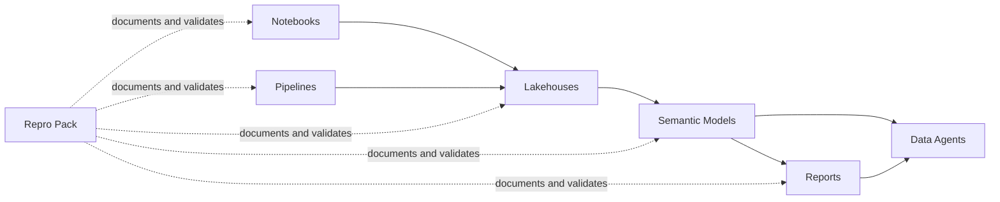

# Shared Fabric Assets

This folder stores Microsoft Fabric implementation assets, grouped by artifact type so they can be reused across environments.

## Folder layout

- `semantic-models/`: semantic model definitions (`.pbism`, `.tmdl`, related metadata).
- `reports/`: Power BI/Fabric report definitions and visual resources.
- `notebooks/`: Fabric notebook code and notebook assets.
- `pipelines/`: data pipeline definitions and orchestration metadata.
- `lakehouses/`: Lakehouse and SQL endpoint metadata.
- `data-agents/`: Data agent and Reflex/Activator metadata.
- `repro/`: reproducible exports, sanitization scripts, and replay guides.

For this solution snapshot, item folders are grouped under:
- `*/ext_fabric_space_moaz_selected_11/`

## End-to-end relationship

## Delta tables quick map (easiest way to remember)

### Semantic model: `semantic_model_purview_dataproduct_residency_gold`

| Delta table | Purpose | Measures in table | Feeds which visual(s) |
|---|---|---|---|
| `dp_dataproduct_assetcount_deltas` | Tracks per-data-product asset count changes between snapshots (previous vs current). | None (column-driven table). | `tableEx` visual `8ac2e454e8e0b4000158` on page **Sovereignty Monitoring** (`Data Product Asset Count over Time`). |
| `dp_dataproduct_residency_deltas` | Tracks residency region changes by data product between snapshots. | `Residency Changes (Last Run)` | `cardVisual` `0fa839b0d235cd022d64` on page **Alert Cards**; `tableEx` `80a7f7a0bc4a8a0d0bd0` on page **Sovereignty Monitoring**. |
| `dp_purviewassetcount_deltas` | Tracks total Purview asset count movement and detects spike/drop events. | `Purview DeltaPct (Last Run)`, `Purview SpikeDrop Flag (Last Run)` | `cardVisual` `0acda5406b40770aec09` on page **Alert Cards** uses `Purview SpikeDrop Flag (Last Run)`. |

### Semantic model: `Compliance Scoring Model`

- No `_deltas` tables are defined in this model.
- This model is current-state oriented (compliance and investigation state tables), not change-over-time delta-table oriented.

## Practical reading order for new users

1. Start with `reports/ext_fabric_space_moaz_selected_11/report_purview_dataproduct_residency__Report` to see what users consume.
2. Trace each visual back to `semantic-models/ext_fabric_space_moaz_selected_11/semantic_model_purview_dataproduct_residency_gold__SemanticModel/definition/definition/tables`.
3. Use `repro/ext_fabric_space_moaz_selected_11/import-order-and-rebind-runbook.md` when recreating in another tenant.
