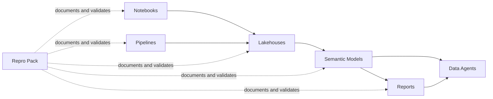

# Shared Fabric Assets

This folder stores Microsoft Fabric implementation assets, grouped by artifact type so they can be reused across environments.

## Folder layout

- `semantic-models/`: semantic model definitions (`.pbism`, `.tmdl`, related metadata).
- `reports/`: Power BI/Fabric report definitions and visual resources.
- `notebooks/`: Fabric notebook code and notebook assets.
- `pipelines/`: data pipeline definitions and orchestration metadata.
- `lakehouses/`: Lakehouse and SQL endpoint metadata.
- `data-agents/`: Data agent and Reflex/Activator metadata.
- `repro/`: reproducible exports, sanitization scripts, and replay guides.

## End-to-end relationship

## Complete table inventory & report mapping

### Semantic model: `semantic_model_purview_dataproduct_residency_gold`

**20 tables: dimension + fact + delta (DirectLake from lakehouse)**

| Table Name | Purpose / Description | Measures (if any) | Key Columns | Feeds Report Visual(s) |
|---|---|---|---|---|
| **Data Products** | Dimension: master list of all data products with residency & compliance metadata. | `Total Data Products`, `Products with Residency`, `Residency Coverage %`, `Products Missing Residency`, `Total Product Assets QA`, `Product Assets (Missing Residency)`, `Missing Residency Product Assets %`, `HasFullName_DP` | `ID`, `Name`, `Residency`, `Description`, `Owner` | Slicer (dropdown) on Alert Cards & Sovereignty Monitoring pages |
| **Data Product Assets Count** | Dimension: point-in-time asset counts per data product (current state). | None | `DataProductId`, `DataProductName`, `TotalAssets`, `AssetCategoryCount` | Used in compliance summary calculations |
| **dp_dataproduct_assetcount_deltas** | Fact (delta): per-product asset count changes between snapshots. Compares current vs previous assets. | None (column-driven) | `SnapshotTS`, `SnapshotDate`, `DataProductName`, `TotalAssets`, `PrevAssets`, `DeltaAssets`, `DeltaPct` | Table visual on **Sovereignty Monitoring** page (Asset Count Over Time) |
| **dp_dataproduct_residency_deltas** | Fact (delta): residency region changes by data product. Flags when residency changes between runs. | `Residency Changes (Last Run)` | `SnapshotUtc`, `SnapshotDate`, `DataProductID`, `DataProductDisplayName`, `PrevResidencyRegion`, `ResidencyRegion`, `HasChanged` | Card visual on **Alert Cards** page; Table on **Sovereignty Monitoring** |
| **dp_purviewassetcount_deltas** | Fact (delta): total Purview asset volume & spike/drop detection. Tracks asset count movement & flags anomalies. | `Purview DeltaPct (Last Run)`, `Purview SpikeDrop Flag (Last Run)` | `SnapshotUtc`, `TotalAssets`, `PrevTotalAssets`, `DeltaAssets`, `DeltaPct`, `IsApproximate` | Card visual on **Alert Cards** (Spike/Drop Flag indicator) |
| **Purview Total Assets Count** | Dimension (current): latest total Purview asset count snapshot. | None | `SnapshotUtc`, `TotalAssets`, `IsApproximate` | Used in overview/header calculations |
| **dp_dataproduct_residencycompliance_current** | Dimension (current): residency compliance state per data product (latest snapshot). | `Avg Residency Compliance Score %` | `SnapshotTimeUtc`, `DataProductID`, `DataProductDisplayName`, `GlossaryResidencyRegionName`, `IsApprovedResidency`, `AzureResourceFound`, `AzureResourceCount` | Scorecard visuals on **Sovereignty Monitoring** |
| **dp_dataproduct_compliance_summary_current** | Dimension (current): master compliance scores for all dimensions (residency, CC, defender, tag, patch) per product. | None | `Data Product ID`, `Data Product Name`, `Residency Compliance (%)`, `Conf. Compute Compliance (%)`, `Defender Compliance (%)`, `Tag Compliance (%)`, `Patch Compliance (%)` | Scorecard/matrix visuals on **Sovereignty Monitoring**; Filtering across pages |
| **dp_compute_inventory_current** | Dimension (current): compute resource inventory by data product (Synapse, DataFactory, AML, etc.). Includes location, subscription, security type. | None | `SnapshotUtc`, `DataProductId`, `ComputeResourceId`, `ComputeName`, `ResourceGroup`, `SubscriptionId`, `Location`, `SecurityType`, `IsConfidential` | Compute compliance investigation workflows |
| **dp_dataproduct_tagcompliance_current** | Dimension (current): tag compliance scoring for resources (fabric, S3, SQL, storage). Tracks if origin/zone tags are present & allowed. | `Avg Tag Compliance Score %` | `DataProductId`, `resourceFound20`, `sovereigntyZoneExists20`, `resourceOriginExists20`, `IsFabric`, `IsS3`, `IsSqlPaaS`, `IsStorage`, `TagScorePct` | Tag compliance scorecard visuals |
| **dp_dataproduct_cccompliance_current** | Dimension (current): Confidential Compute (CC) compliance per data product. | None | `SnapshotUtc`, `DataProductId`, `CCScorePct`, `CCResourceCount`, `ApprovedCCCount` | CC compliance scorecard visuals |
| **dp_dataproduct_cccompliance_investigate_current** | Dimension (investigative): detail table for CC compliance investigation per resource. Lists non-compliant resources. | None | `DataProductDisplayName`, `ResourceType`, `LookupSkuOrModel`, `OwnerEmail`, `CCReason`, `IsInvestigated`, `InvestigationStatus` | Table visual on **Compliance Investigation** page |
| **dp_dataproduct_defendercompliance_current** | Dimension (current): Defender for Cloud compliance state per product. | None | `SnapshotUtc`, `DataProductId`, `DefenderScorePct`, `DefenderAlertCount`, `CriticalFindings` | Defender compliance scorecard visuals |
| **dp_dataproduct_fullnameclassification_current** | Dimension (current): data classification completeness (whether product has full name/classification). | None | `DataProductId`, `HasFullNameClassification`, `ClassificationLevel`, `LastUpdated` | Metadata completeness checks |
| **dp_dataproduct_fullname_not_confidential_current** | Dimension (current): products that have full name but are NOT CC-eligible. | None | `DataProductId`, `DataProductName`, `ReasonNotCC`, `VerifiedDate` | Compliance workflow filtering |
| **dp_dataproduct_fullname_no_compute_mapping_current** | Dimension (current): products with full names but missing compute resource mappings. | None | `DataProductId`, `DataProductName`, `MissingComputeTypes`, `MappingGap` | Data quality monitoring |
| **dp_dataproduct_residencycompliance_current** (lookup) | Dimension (reference): residency metadata & compliance flags. | None | `Region`, `ApprovedResidencyZones`, `IsCompliantRegion` | Residency validation filtering |
| **dp_sovereignty_kpis_timeline_table** | Fact: historical KPI snapshots for sovereignty monitoring trends. | None | `SnapshotUtc`, `TotalProducts`, `ProductsCompliant`, `ResidencyPercent`, `ComputeCompliant` | Timeline/trend charts on **Sovereignty Monitoring** |
| **Copilot Purview Residency Change Eligibility** | Dimension: eligibility criteria for products to be flagged for residency change notifications (used by Data Agent). | None | `DataProductId`, `IsEligibleForNotif`, `HandoffReadiness`, `NotificationPreference` | Data Agent logic & alerting |
| **Data Product Assets Count** | Aggregate: point-in-time count of assets per product (latest). Used for roll-up calculations. | None | `DataProductName`, `TotalAssets`, `AssetCategoryCount`, `LastUpdated` | Compliance summary aggregations |

### Semantic model: `Compliance Scoring Model` (4 tables)

| Table Name | Purpose | Measures (if any) | Key Columns | Used By |
|---|---|---|---|---|
| **Data Products** | Dimension: product identifiers & metadata (similar to other model, but isolated). | `Total Data Products`, `Products with Residency`, etc. | `ID`, `Name`, `Owner` | Report page filters |
| **Data Product Compliance Scores** | Fact: compliance score aggregations across multiple dimensions. | None | `DataProductId`, `TotalScore`, `ResidencyScore`, `CCScore`, `DefenderScore` | Compliance dashboard visuals |
| **Confidential Compute (cc) Resource Signals (Current)** | Dimension: CC resource signal tracking (usage patterns, readiness). | None | `DataProductId`, `ResourceType`, `SignalStrength`, `LastSignalDate` | CC adoption monitoring |
| **Confidential Compute (cc) PII Compliance Investigations (Current)** | Dimension: investigation records for PII in non-CC resources. | None | `DataProductId`, `PiiRiskLevel`, `ResourceId`, `InvestigationStatus`, `Owner` | PII risk assessment visuals |

## Practical reading order for new users

1. Start with `reports/` to see what users consume (two reports total).
2. Trace each visual back to which table + measure it references.
3. Read table descriptions to understand data freshness & purpose.
4. Use `repro/` when recreating in another tenant.

## Report pages & their key visuals

### Report: `report_purview_dataproduct_residency__Report`

**Page: Alert Cards**
- Card: Residency Changes (Last Run) — uses `Residency Changes (Last Run)` measure from `dp_dataproduct_residency_deltas`
- Card: Purview Spike/Drop Flag — uses `Purview SpikeDrop Flag (Last Run)` from `dp_purviewassetcount_deltas`
- Card: Total Data Products — uses `Total Data Products` measure from `Data Products`

**Page: Sovereignty Monitoring**
- Scorecard: Avg Residency Compliance Score — uses `Avg Residency Compliance Score %` from `dp_dataproduct_residencycompliance_current`
- Table: Data Product Asset Count Over Time — queries `dp_dataproduct_assetcount_deltas` (SnapshotTS, DataProductName, TotalAssets, DeltaAssets, DeltaPct)
- Table: Residency Changes — queries `dp_dataproduct_residency_deltas` (SnapshotUtc, Region, HasChanged)
- Matrix: Compliance Scores (Residency, CC, Defender, Tag, Patch) — uses columns from `dp_dataproduct_compliance_summary_current`
- Slicer (Dropdown): Data Product selector — uses `Data Products` table

**Page: Compliance Investigation**
- Table: CC Compliance Issues — queries `dp_dataproduct_cccompliance_investigate_current` (DataProductDisplayName, ResourceType, CCReason, OwnerEmail)

### Report: `Compliance Scoring Report for Data Agent`

- Scorecards & matrix visuals rendering compliance state from `Data Product Compliance Scores` & `Confidential Compute (cc) PII Compliance Investigations (Current)`
- Published as output for Copilot/Data Agent consumption

## Table type legend

- **Dimension (current-state)**: `*_current` suffix. Single latest snapshot per data product. Refreshed nightly. Safe for real-time filtering.
- **Fact (delta-tracking)**: `*_deltas` suffix. Multiple rows per product (one per snapshot run). Tracks changes between snapshots.
- **Dimension (dimension/reference)**: Dimension-style table without `_current` suffix (e.g., `Data Products`, `Copilot Purview Residency Change Eligibility`). Master reference.
- **Fact (aggregate/timeline)**: `*_timeline_table`, `*_kpis_*`. Historical snapshots for trend analysis.
- **All source**: DirectLake from `ext_lakehouse_fabric_moaz` lakehouse. Zero-copy DirectLake query engine.

## Data freshness expectations

- `*_current` tables: refreshed nightly (~2 AM UTC) via notebook workflow
- `*_deltas` tables: snapshot table created at end of each nightly run (captures state at that moment; can be queried to see what changed since previous run)
- `dp_sovereignty_kpis_timeline_table`: one row appended per nightly run; use for trending

## Quick how-to guide

**Q: How do I find which tables feed a specific report visual?**
- Open report visual JSON file in `reports/report_purview_dataproduct_residency__Report/definition/definition/pages/[PAGE_ID]/visuals/[VISUAL_ID]/visual.json`
- Look for `"Entity": "TableName"` and `"Property": "ColumnOrMeasureName"` entries

**Q: What measures are available for reporting?**
- Measures are defined inside TMDL files in each table section
- Examples: `Residency Changes (Last Run)`, `Total Data Products`, `Avg Residency Compliance Score %`
- See table inventory above for which tables define which measures

**Q: How do I add a new visualization?**
1. Identify which table(s) to use from inventory above
2. Open semantic model TMDL files to see available columns & measures
3. Create visual in Power BI/Fabric, bind to table/measure
4. Export report definition, commit to git
