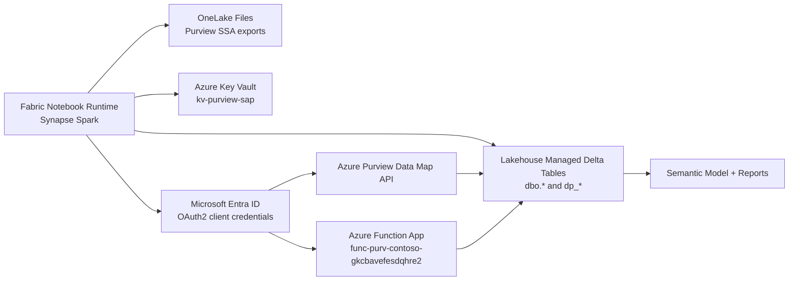

# Notebook Execution Blocks, Components, and Authentication Deep Dive

This guide explains the full execution story for both notebooks:
- Block-by-block transformations
- External components each block interacts with
- Authentication method used per component
- Exact API surface used (where applicable)

## End-to-End Component Story



## Notebook 1

### Notebook Name
Refresh And Automate Purview parquet to gold__Notebook

### Primary Purpose
Materialize Purview self-serve analytics exports into Lakehouse Delta tables, build gold/historical/delta KPI tables, and maintain report-ready trend datasets.

### External Component Interactions

| Component | How notebook interacts | Authentication method | Technical details |
|---|---|---|---|
| OneLake Files area | Reads Purview export folders under Files/purview_meta_data/DomainModel | Fabric workspace data plane access | Spark parquet/delta reads from DomainModel entities such as DataProduct, GlossaryTerm, DataAssetColumn, Classification |
| Lakehouse metastore | Creates/overwrites managed Delta tables (dbo.* and dp_*) | Fabric runtime permissions | saveAsTable and SQL CREATE TABLE/INSERT OVERWRITE |
| Azure Key Vault: kv-purview-sap | Reads secrets used by API callers | notebookutils.credentials.getSecret with notebook execution identity | Secret names include Secret-for-Purview-SAP-SP-Moaz and related app secrets |
| Microsoft Entra ID token endpoint | Issues OAuth token for Purview API | OAuth2 client credentials grant using MSAL | Authority: https://login.microsoftonline.com/{tenantId} |
| Azure Purview Data Map API | Fetches current global asset count | Bearer token for resource scope https://purview.azure.net/.default | Endpoint used: https://ext-purview-moaz.purview.azure.com/datamap/api/search/query?api-version=2023-09-01 with keywords=* |

### Block Flow With Component Context

1. Dependencies
- Installs/loads msal for OAuth token acquisition.

2. Raw ingest (Files -> dbo)
- Reads Parquet/Delta exports from OneLake Files DomainModel.
- Writes managed tables in Lakehouse for downstream SQL and reporting.

3. Gold residency table
- Joins product + glossary + assignment entities.
- Produces dp_dataproductresidency_gold as current product-to-region mapping.

4. Residency history
- Appends timestamped snapshots to dp_dataproductresidency_history.

5. Gold asset-count table
- Aggregates DataProduct to DataAsset relationships.
- Produces dp_dataproduct_assetcounts_gold.

6. Asset-count history
- Appends snapshots into dp_dataproduct_assetcounts_history.

7. Purview global count pull
- Gets secret from Key Vault.
- Acquires Entra token using client credentials.
- Calls Purview Data Map Search Query API and captures @search.count.
- Writes one-row current table dp_purviewassetcount_current.

8. Purview history
- Merges current row into dp_purviewassetcount_history to preserve trend history.

9. Delta/anomaly tables
- Uses window LAG over history tables.
- Produces dp_purviewassetcount_deltas, dp_dataproduct_assetcount_deltas, dp_dataproduct_residency_deltas.

10. Unified KPI timeline
- Time-aligns Purview, asset, and residency snapshots with AS-OF style logic.
- Produces dp_sovereignty_kpis_timeline_table for reporting.

### Notebook 1 Transformation Map

```text
OneLake Files (Purview SSA DomainModel)
  -> dbo raw tables
  -> gold tables (residency, asset counts)
  -> history tables (append per run)
  -> delta tables (change detection with LAG)
  -> unified KPI timeline
  -> semantic model/report consumption
```

---

## Notebook 2

### Notebook Name
notebook_fabric_function_sov_compliance_checks_new__Notebook

### Primary Purpose
Compute compliance scores by calling Azure Function endpoints (tag, residency, confidential compute for PII, defender), then persist current and historical scorecards.

### External Component Interactions

| Component | How notebook interacts | Authentication method | Technical details |
|---|---|---|---|
| Azure Key Vault: kv-purview-sap | Reads Function App client secret | notebookutils.credentials.getSecret with notebook execution identity | Secret name used: Secret-for-spn-func-compliance-check |
| Microsoft Entra ID token endpoint | Issues access token for Function API audience | OAuth2 client credentials grant using MSAL | Scope used: api://fec2dea8-4aa7-4903-bab4-7139a09b9056/.default |
| Function App | Calls compliance APIs in batches | Bearer token to Function App EasyAuth-protected API | Base URL: https://func-purv-contoso-gkcbavefesdqhre2.eastus2-01.azurewebsites.net |
| Function route: tagCompliance | Evaluates resource tag compliance | Same token as above | POST /api/azure/tagCompliance |
| Function route: residencyCompliance | Evaluates residency compliance | Same token as above | POST /api/azure/residencyCompliance |
| Function route: ccForPiiCompliance | Evaluates confidential compute for PII workloads | Same token as above | POST /api/azure/ccForPiiCompliance |
| Function route: defenderCompliance | Evaluates Defender enablement posture | Same token as above | POST /api/azure/defenderCompliance |
| Lakehouse metastore | Writes current/history compliance tables | Fabric runtime permissions | Delta overwrite for current, append/conform for history |

### Block Flow With Component Context

1. Setup and config
- Loads route map, subscriptions, batch size, tenant/app/audience IDs.

2. Secrets and auth plumbing
- Pulls client secret from Key Vault.
- Uses MSAL client credentials against Entra.
- Gets bearer token for Function App audience.

3. Shared helpers
- Token acquisition helper.
- Batched POST helper with retry/backoff.
- Delta write helpers with schema-conformance for history append.

4. Base data and applicability flags
- Reads dp_dataproductresidency_gold as base product set.
- Optionally joins dp_dataproduct_fullnameclassification_current for PII applicability.
- Derives TagApplicable, ResidencyApplicable, CCApplicable, DefenderApplicable.

5-12. Compliance API scoring loops
- Sends batched DataProductIds and subscriptions to each function route.
- Parses results arrays from JSON responses.
- Writes each compliance domain into current/history tables:
  - dp_dataproduct_tagcompliance_current/history
  - dp_dataproduct_residencycompliance_current/history
  - dp_dataproduct_cccompliance_current/history
  - dp_dataproduct_defendercompliance_current/history

13. Optional compliance summary
- Combines domain-specific outputs into a single product-level summary table for matrix/scorecard visuals.

### Notebook 2 Transformation Map

```text
Base product table + optional PII classification
  -> applicability flags
  -> batched calls to 4 Function App routes
  -> parsed response dataframes
  -> 4 domain scorecards (current/history)
  -> optional unified compliance summary
  -> semantic model/report consumption
```

---

## Authentication Cheat Sheet

| Target component | Auth type | Grant flow | Credential source | Token audience/scope |
|---|---|---|---|---|
| Azure Key Vault (secret read) | Notebook identity to Key Vault | Platform-managed | notebookutils.credentials.getSecret | N/A (handled by Fabric runtime) |
| Purview Data Map API | Entra OAuth bearer token | Client credentials via MSAL | KV secret: Secret-for-Purview-SAP-SP-Moaz | https://purview.azure.net/.default |
| Function App APIs | Entra OAuth bearer token + EasyAuth | Client credentials via MSAL | KV secret: Secret-for-spn-func-compliance-check | api://fec2dea8-4aa7-4903-bab4-7139a09b9056/.default |

## Data Transformation Reference Table

| Notebook | Block | Input | Transformation | Output | Purpose |
|---|---|---|---|---|---|
| Notebook 1 | Raw ingest | DomainModel files | Spark read + overwrite to Delta | dbo.* tables | Normalize Purview exports for SQL analytics |
| Notebook 1 | Gold build | Raw dbo.* | SQL joins + aggregations | dp_dataproductresidency_gold, dp_dataproduct_assetcounts_gold | Curated current-state datasets |
| Notebook 1 | History build | Gold/current tables | Append or merge snapshots | *_history tables | Time-series lineage and trends |
| Notebook 1 | Delta build | *_history tables | LAG/arithmetics | *_deltas tables | Drift/spike detection |
| Notebook 1 | KPI timeline | Multiple histories | AS-OF alignment + denorm | dp_sovereignty_kpis_timeline_table | Single report-ready trend surface |
| Notebook 2 | Applicability | Base product + optional PII | Rule derivation and filtering | Enriched base dataframe | Decide which checks apply |
| Notebook 2 | API scoring | Enriched base dataframe | Batched POST + JSON parse | Domain score dataframes | Compute compliance scores |
| Notebook 2 | Persist | Domain score dataframes | Delta overwrite/append with schema conform | current/history score tables | Durable reporting state |

## Key Takeaways

- Notebook 1 is ingestion and KPI engineering, including a direct Purview Data Map API dependency.
- Notebook 2 is compliance scoring orchestration through a secured Function App API surface.
- Both notebooks rely on Key Vault plus Entra client credentials for external API interactions.
- Reporting consumes the resulting current/history/delta tables through semantic models and report artifacts.
