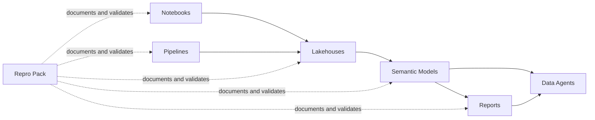
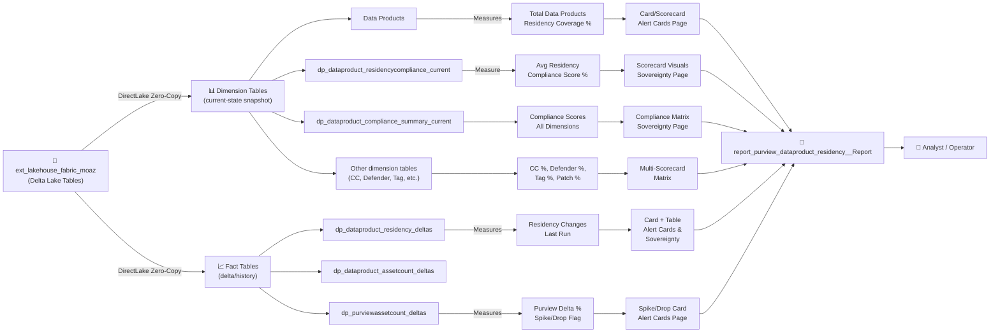
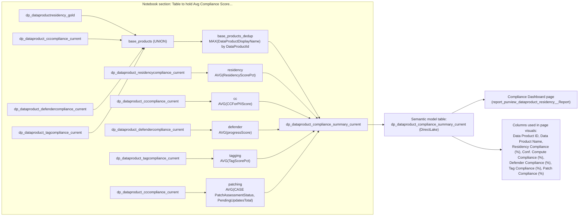

# Shared Fabric Assets

This folder stores Microsoft Fabric implementation assets, grouped by artifact type so they can be reused across environments.

## Folder layout

- `semantic-models/`: semantic model definitions (`.pbism`, `.tmdl`, related metadata).
- `reports/`: Power BI/Fabric report definitions and visual resources.
- `notebooks/`: Fabric notebook code and notebook assets.
- `pipelines/`: data pipeline definitions and orchestration metadata.
- `lakehouses/`: Lakehouse and SQL endpoint metadata.
- `data-agents/`: Data agent and Reflex/Activator metadata.
- `repro/`: reproducible exports, sanitization scripts, and replay guides.

## End-to-end relationship

## Data lineage: Lakehouse → Tables → Measures → Report visuals

## Page-specific lineage: Sovereignty Monitoring (Compliance-only)

Purpose: Compliance-only lineage for Sovereignty Monitoring, focused on the compliance matrix/score visuals sourced from `dp_dataproduct_compliance_summary_current`.

Column derivation in `dp_dataproduct_compliance_summary_current` (from notebook SQL):
- `Data Product ID`: from `base_products_dedup.DataProductId` (union of product IDs from base + current compliance tables).
- `Data Product Name`: from `base_products_dedup.DataProductDisplayName` (`MAX` name per product ID).
- `Residency Compliance (%)`: `ROUND(AVG(ResidencyScorePct),0)` from `dp_dataproduct_residencycompliance_current`.
- `Conf. Compute Compliance (%)`: `ROUND(AVG(CCForPIIScore),0)` from `dp_dataproduct_cccompliance_current`.
- `Defender Compliance (%)`: `ROUND(AVG(progressScore),0)` from `dp_dataproduct_defendercompliance_current`.
- `Tag Compliance (%)`: `ROUND(AVG(TagScorePct),0)` from `dp_dataproduct_tagcompliance_current`.
- `Patch Compliance (%)`: `ROUND(AVG(CASE PatchAssessmentStatus/PendingUpdatesTotal ...),0)` from `dp_dataproduct_cccompliance_current`.

## Lakehouse tables used across notebooks, Copilot, semantic models, and reports

This section focuses on the Lakehouse tables that downstream components query or surface directly: Copilot topics and flows, the data agent, the two semantic models, and the two reports. Notebook-only raw/staging tables are intentionally excluded.

| Lakehouse Table | Short Purpose | Used By | Key Columns |
|---|---|---|---|
| `dp_dataproductresidency_gold` | Gold product-level residency table built from Purview product + glossary assignment data. | Both notebooks; semantic-model alias `Data Products`; flow `RetrieveSovDashboardInfo`; report `report_purview_dataproduct_residency__Report`; Compliance Scoring Model | `DataProductID`, `DataProductDisplayName`, `DataProductDescription`, `ResidencyRegion` |
| `dp_dataproduct_assetcounts_gold` | Current Purview asset counts per data product. | Notebook: `Refresh And Automate Purview parquet to gold`; asset-count history/deltas; residency semantic model/report | `DataProductName`, `TotalAssets` |
| `dp_purviewassetcount_current` | Latest total Purview asset count snapshot. | Notebook: `Refresh And Automate Purview parquet to gold`; semantic model alias `Purview Total Assets Count`; alert-card reporting | `SnapshotUtc`, `TotalAssets`, `IsApproximate` |
| `dp_purviewassetcount_deltas` | Delta/spike tracking for overall Purview asset counts between snapshots. | Notebook: `Refresh And Automate Purview parquet to gold`; semantic model; `Alert Cards` page in `report_purview_dataproduct_residency__Report` | `SnapshotUtc`, `TotalAssets`, `PrevTotalAssets`, `DeltaAssets`, `DeltaPct` |
| `dp_dataproduct_assetcount_deltas` | Delta tracking for per-product asset counts over time. | Notebook: `Refresh And Automate Purview parquet to gold`; semantic model; `Sovereignty Monitoring` page | `SnapshotTS`, `SnapshotDate`, `DataProductName`, `TotalAssets`, `DeltaAssets`, `DeltaPct` |
| `dp_dataproduct_residency_deltas` | Delta tracking for residency changes between snapshots. | Notebook: `Refresh And Automate Purview parquet to gold`; semantic model; `Alert Cards` and `Sovereignty Monitoring` pages | `SnapshotUtc`, `SnapshotDate`, `DataProductID`, `DataProductDisplayName`, `PrevResidencyRegion`, `ResidencyRegion`, `HasChanged` |
| `dp_sovereignty_kpis_timeline_table` | Unified nightly KPI timeline for sovereignty trend reporting. | Notebook: `Refresh And Automate Purview parquet to gold`; semantic model trend visuals | `SnapshotUtc`, `TotalProducts`, `ProductsCompliant`, `ResidencyPercent`, `ComputeCompliant` |
| `dbo.dp_dataproduct_fullnameclassification_current` | Current per-product flag showing whether assets contain `MICROSOFT.PERSONAL.NAME`. | Both notebooks; flow `Retrieve_CCPII_Eligibility`; Compliance Scoring Model; data agent CC/PII scenarios | `SnapshotUtc`, `DataProductId`, `DataProductDisplayName`, `HasFullNameClassification`, `FullNameColumnCount` |
| `dbo.dp_compute_inventory_current` | Current compute inventory mapped to data products from Azure Resource Graph. | Both notebooks; CC/PII derived tables; Compliance Scoring Model | `SnapshotUtc`, `DataProductId`, `ComputeResourceId`, `ComputeName`, `Location`, `IsConfidential` |
| `dbo.dp_dataproduct_fullname_not_confidential_current` | Exception list: products with Full Name classification mapped to non-confidential compute. | Notebook: `Refresh And Automate Purview parquet to gold`; CC/PII reasoning for agent/data agent | `SnapshotUtc`, `DataProductId`, `DataProductDisplayName`, `FullNameColumnCount`, `ComputeVmCount`, `IsConfidentialCompute` |
| `dbo.dp_dataproduct_fullname_no_compute_mapping_current` | Exception list: products with Full Name classification but no mapped compute. | Notebook: `Refresh And Automate Purview parquet to gold`; CC/PII reasoning for agent/data agent | `SnapshotUtc`, `DataProductId`, `DataProductDisplayName`, `FullNameColumnCount`, `ComputeVmCount` |
| `rs_approved_regions` | Authoritative rule table of approved residency region codes. | Notebook: `notebook_fabric_function_sov_compliance_checks_new`; residency scorecard; Copilot eligibility gating; Purview update workflow | `region_name`, `region_code`, `approved`, `notes` |
| `dp_dataproduct_residencycompliance_current` | Latest residency scorecard output per data product, including glossary state, detected resource region, score, and reason. | Notebook: `notebook_fabric_function_sov_compliance_checks_new`; semantic model; `report_purview_dataproduct_residency__Report`; eligibility table build | `SnapshotTimeUtc`, `DataProductID`, `GlossaryResidencyRegionCode`, `AzureLocations`, `AzureLocationMatch`, `ResidencyScorePct`, `ResidencyScoreReason` |
| `dp_dataproduct_tagcompliance_current` | Current tag-compliance scorecard per data product. | Notebook: `notebook_fabric_function_sov_compliance_checks_new`; compliance summary; semantic model/report | `DataProductId`, `DataProductDisplayName`, `TagScorePct`, `resourceFound20`, `sovereigntyZoneExists20`, `resourceOriginExists20` |
| `dp_dataproduct_cccompliance_current` | Current confidential-compute-for-PII scorecard per data product. | Notebook: `notebook_fabric_function_sov_compliance_checks_new`; Compliance Scoring Model; `Retrieve_CCPII_Eligibility`; data agent | `DataProductId`, `DataProductDisplayName`, `CCForPIIScore`, `PatchAssessmentStatus`, `PendingUpdatesTotal`, `ApprovedCCCount` |
| `dp_dataproduct_cccompliance_investigate_current` | Investigation queue for CC/PII findings, owners, and remediation context. | Notebook: `notebook_fabric_function_sov_compliance_checks_new`; Compliance Scoring Model; `Compliance Investigation` page; data agent | `DataProductId`, `DataProductDisplayName`, `ResourceId`, `ResourceType`, `OwnerEmail`, `CCReason`, `InvestigationStatus` |
| `dp_dataproduct_defendercompliance_current` | Current Defender compliance scorecard per data product. | Notebook: `notebook_fabric_function_sov_compliance_checks_new`; compliance summary; semantic model/report | `dataProductId`, `progressScore`, `DefenderStatus`, `RecommendationCount` |
| `dp_copilot_purview_residency_change_eligibility` | Deterministic Copilot gating table for Purview residency updates, including target code, expected current code, eligibility boolean, and action hint. | Notebook: `notebook_fabric_function_sov_compliance_checks_new`; flow `RetrieveSovDashboardInfo`; topic `Purview Residency Glossary Update Workflow`; semantic-model alias `Copilot Purview Residency Change Eligibility` | `DataProductID`, `AzureResidencyCode`, `ExpectedCurrentResidencyCode`, `TargetResidencyCode`, `EligibleForResidencyUpdate`, `EligibilityReason`, `SuggestedPurviewResidencyAction` |
| `dp_dataproduct_compliance_summary_current` | Flattened per-product cross-domain compliance summary used by report matrix/scorecards and the data agent. | Notebook: `notebook_fabric_function_sov_compliance_checks_new`; semantic-model alias `Data Product Compliance Scores`; both reports; data agent | `Data Product ID`, `Data Product Name`, `Residency Compliance (%)`, `Conf. Compute Compliance (%)`, `Defender Compliance (%)`, `Tag Compliance (%)`, `Patch Compliance (%)` |

## Complete table inventory & report mapping

### Semantic model: `semantic_model_purview_dataproduct_residency_gold`

**20 tables: dimension + fact + delta (DirectLake from lakehouse)**

| Table Name | Fact vs Dimension | Purview metadata reference | Purpose / Description | Measures (if any) | Key Columns | Feeds Report Visual(s) |
|---|---|---|---|---|---|---|
| **Data Products** | Dimension (reference) | `Files/purview_meta_data/DomainModel/DataProduct` (plus glossary assignment entities used by gold build) | Dimension: master list of all data products with residency & compliance metadata. | `Total Data Products`, `Products with Residency`, `Residency Coverage %`, `Products Missing Residency`, `Total Product Assets QA`, `Product Assets (Missing Residency)`, `Missing Residency Product Assets %`, `HasFullName_DP` | `ID`, `Name`, `Residency`, `Description`, `Owner` | Slicer (dropdown) on Alert Cards & Sovereignty Monitoring pages |
| **Data Product Assets Count** | Dimension (current snapshot) | `Files/purview_meta_data/DomainModel/DataProduct`, `DataAsset`, `DataProductAssetAssignment` (via `dp_dataproduct_assetcounts_gold`) | Dimension: point-in-time asset counts per data product (current state). | None | `DataProductId`, `DataProductName`, `TotalAssets`, `AssetCategoryCount` | Used in compliance summary calculations |
| **dp_dataproduct_assetcount_deltas** | Fact (delta) | Derived from Purview-product/asset exports: `DataProduct`, `DataAsset`, `DataProductAssetAssignment` | Fact (delta): per-product asset count changes between snapshots. Compares current vs previous assets. | None (column-driven) | `SnapshotTS`, `SnapshotDate`, `DataProductName`, `TotalAssets`, `PrevAssets`, `DeltaAssets`, `DeltaPct` | Table visual on **Sovereignty Monitoring** page (Asset Count Over Time) |
| **dp_dataproduct_residency_deltas** | Fact (delta) | Derived from residency gold rooted in Purview `DataProduct` (+ glossary assignment entities) | Fact (delta): residency region changes by data product. Flags when residency changes between runs. | `Residency Changes (Last Run)` | `SnapshotUtc`, `SnapshotDate`, `DataProductID`, `DataProductDisplayName`, `PrevResidencyRegion`, `ResidencyRegion`, `HasChanged` | Card visual on **Alert Cards** page; Table on **Sovereignty Monitoring** |
| **dp_purviewassetcount_deltas** | Fact (delta) | `Files/purview_meta_data/DomainModel/DataAsset` (total-asset snapshots) | Fact (delta): total Purview asset volume & spike/drop detection. Tracks asset count movement & flags anomalies. | `Purview DeltaPct (Last Run)`, `Purview SpikeDrop Flag (Last Run)` | `SnapshotUtc`, `TotalAssets`, `PrevTotalAssets`, `DeltaAssets`, `DeltaPct`, `IsApproximate` | Card visual on **Alert Cards** (Spike/Drop Flag indicator) |
| **Purview Total Assets Count** | Fact (current snapshot) | `Files/purview_meta_data/DomainModel/DataAsset` (total-asset snapshots) | Fact (current snapshot): latest total Purview asset count snapshot. | None | `SnapshotUtc`, `TotalAssets`, `IsApproximate` | Used in overview/header calculations |
| **dp_dataproduct_residencycompliance_current** | Dimension (current) | Base from Purview `DataProduct` (+ glossary assignment entities) via `dp_dataproductresidency_gold`; enriched by API checks | Dimension (current): residency compliance state per data product (latest snapshot). | `Avg Residency Compliance Score %` | `SnapshotTimeUtc`, `DataProductID`, `DataProductDisplayName`, `GlossaryResidencyRegionName`, `IsApprovedResidency`, `AzureResourceFound`, `AzureResourceCount` | Scorecard visuals on **Sovereignty Monitoring** |
| **dp_dataproduct_compliance_summary_current** | Dimension (current) | Derived table (no direct parquet read): combines current compliance tables; Purview root is `DataProduct`/classification exports feeding those tables | Dimension (current): master compliance scores for all dimensions (residency, CC, defender, tag, patch) per product. | None | `Data Product ID`, `Data Product Name`, `Residency Compliance (%)`, `Conf. Compute Compliance (%)`, `Defender Compliance (%)`, `Tag Compliance (%)`, `Patch Compliance (%)` | Scorecard/matrix visuals on **Sovereignty Monitoring**; Filtering across pages |
| **dp_compute_inventory_current** | Fact (current inventory) | N/A direct Purview parquet (built from Azure Resource Graph; joined by `dataproductid`) | Fact (current inventory): compute resource inventory by data product (Synapse, DataFactory, AML, etc.). Includes location, subscription, security type. | None | `SnapshotUtc`, `DataProductId`, `ComputeResourceId`, `ComputeName`, `ResourceGroup`, `SubscriptionId`, `Location`, `SecurityType`, `IsConfidential` | Compute compliance investigation workflows |
| **dp_dataproduct_tagcompliance_current** | Dimension (current) | Purview `DataProduct` lineage via `dp_dataproductresidency_gold`; compliance values enriched from function API | Dimension (current): tag compliance scoring for resources (fabric, S3, SQL, storage). Tracks if origin/zone tags are present & allowed. | `Avg Tag Compliance Score %` | `DataProductId`, `resourceFound20`, `sovereigntyZoneExists20`, `resourceOriginExists20`, `IsFabric`, `IsS3`, `IsSqlPaaS`, `IsStorage`, `TagScorePct` | Tag compliance scorecard visuals |
| **dp_dataproduct_cccompliance_current** | Dimension (current) | Purview `DataProduct` + `DataAssetColumn` + `Classification` + `DataAssetColumnClassificationAssignment` (via `dp_dataproduct_fullnameclassification_current`), plus API enrichment | Dimension (current): Confidential Compute (CC) compliance per data product. | None | `SnapshotUtc`, `DataProductId`, `CCScorePct`, `CCResourceCount`, `ApprovedCCCount` | CC compliance scorecard visuals |
| **dp_dataproduct_cccompliance_investigate_current** | Fact (investigation queue) | Derived from `dp_dataproduct_cccompliance_current` + owner mapping from `Files/purview_meta_data/DomainModel/DataProductOwner`; base product metadata from `dp_dataproductresidency_gold` | Fact (investigative queue): detail rows for CC compliance investigation per resource. | None | `DataProductDisplayName`, `ResourceType`, `LookupSkuOrModel`, `OwnerEmail`, `CCReason`, `IsInvestigated`, `InvestigationStatus` | Table visual on **Compliance Investigation** page |
| **dp_dataproduct_defendercompliance_current** | Dimension (current) | Purview `DataProduct` lineage via `dp_dataproductresidency_gold`; compliance values enriched from function API | Dimension (current): Defender for Cloud compliance state per product. | None | `SnapshotUtc`, `DataProductId`, `DefenderScorePct`, `DefenderAlertCount`, `CriticalFindings` | Defender compliance scorecard visuals |
| **dp_dataproduct_fullnameclassification_current** | Dimension (current) | `Files/purview_meta_data/DomainModel/DataAssetColumn`, `Classification`, `DataAssetColumnClassificationAssignment`, and `DataProduct` | Dimension (current): data classification completeness (whether product has full name/classification). | None | `DataProductId`, `HasFullNameClassification`, `ClassificationLevel`, `LastUpdated` | Metadata completeness checks |
| **dp_dataproduct_fullname_not_confidential_current** | Fact (derived exception list) | Indirect from Purview classification exports (via `dp_dataproduct_fullnameclassification_current`), plus compute inventory | Fact (derived exception list): products that have full name but are not confidential-compute compliant. | None | `DataProductId`, `DataProductName`, `ReasonNotCC`, `VerifiedDate` | Compliance workflow filtering |
| **dp_dataproduct_fullname_no_compute_mapping_current** | Fact (derived exception list) | Indirect from Purview classification exports (via `dp_dataproduct_fullnameclassification_current`), plus compute inventory | Fact (derived exception list): products with full names but missing compute resource mappings. | None | `DataProductId`, `DataProductName`, `MissingComputeTypes`, `MappingGap` | Data quality monitoring |
| **rs_approved_regions** (rule entity) | Dimension (reference rule table) | N/A Purview export (rules/config entity) | Dimension (reference): approved residency region rules used for residency compliance evaluation. | None | `region_name`, `region_code`, `approved`, `notes` | Residency validation filtering |
| **dp_sovereignty_kpis_timeline_table** | Fact (timeline) | Derived aggregate built from gold/delta tables rooted in Purview `DataProduct`/`DataAsset` exports | Fact: historical KPI snapshots for sovereignty monitoring trends. | None | `SnapshotUtc`, `TotalProducts`, `ProductsCompliant`, `ResidencyPercent`, `ComputeCompliant` | Timeline/trend charts on **Sovereignty Monitoring** |
| **Copilot Purview Residency Change Eligibility** | Dimension (current eligibility) | Derived from `dp_dataproduct_residencycompliance_current` (Purview-rooted through product residency metadata) | Dimension: eligibility criteria for products to be flagged for residency change notifications (used by Data Agent). | None | `DataProductId`, `IsEligibleForNotif`, `HandoffReadiness`, `NotificationPreference` | Data Agent logic & alerting |

### Semantic model: `Compliance Scoring Model` (4 tables)

| Table Name | Fact vs Dimension | Purview metadata reference | Purpose | Measures (if any) | Key Columns | Used By |
|---|---|---|---|---|---|---|
| **Data Products** | Dimension (reference) | Physical source table: `dp_dataproductresidency_gold`; Purview export root: `Files/purview_meta_data/DomainModel/DataProduct` (plus glossary assignment entities in residency gold build) | Dimension: product identifiers & metadata (similar to other model, but isolated). | `Total Data Products`, `Products with Residency`, etc. | `ID`, `Name`, `Owner` | Report page filters |
| **Data Product Compliance Scores** | Dimension (current score snapshot) | Physical source table: `dp_dataproduct_compliance_summary_current` (created in `notebook_fabric_function_sov_compliance_checks_new`); Purview root: `DataProduct`, plus classification exports (`DataAssetColumn`, `Classification`, `DataAssetColumnClassificationAssignment`) via upstream compliance tables | Dimension: per-product compliance score snapshot across residency, CC, defender, tag, patch. | None | `DataProductId`, `TotalScore`, `ResidencyScore`, `CCScore`, `DefenderScore` | Compliance dashboard visuals |
| **Confidential Compute (cc) Resource Signals (Current)** | Dimension (current signal snapshot) | Physical source table: `dp_dataproduct_cccompliance_current`; Purview root: `DataProduct` plus classification exports (`DataAssetColumn`, `Classification`, `DataAssetColumnClassificationAssignment`), enriched with compute/API signals | Dimension: CC resource signal tracking (usage patterns, readiness). | None | `DataProductId`, `ResourceType`, `SignalStrength`, `LastSignalDate` | CC adoption monitoring |
| **Confidential Compute (cc) PII Compliance Investigations (Current)** | Fact (investigation work queue) | Physical source table: `dp_dataproduct_cccompliance_investigate_current`; Purview root: `Files/purview_meta_data/DomainModel/DataProductOwner` + Purview product/classification lineage used by upstream CC tables | Fact-like investigation records for PII-related non-CC findings and owner follow-up. | None | `DataProductId`, `PiiRiskLevel`, `ResourceId`, `InvestigationStatus`, `Owner` | PII risk assessment visuals |

## Practical reading order for new users

1. Start with `reports/` to see what users consume (two reports total).
2. Trace each visual back to which table + measure it references.
3. Read table descriptions to understand data freshness & purpose.
4. Use `repro/` when recreating in another tenant.

## Report pages & their key visuals

### Report: `report_purview_dataproduct_residency__Report`

**Page: Alert Cards**
- Card: Residency Changes (Last Run) — uses `Residency Changes (Last Run)` measure from `dp_dataproduct_residency_deltas`
- Card: Purview Spike/Drop Flag — uses `Purview SpikeDrop Flag (Last Run)` from `dp_purviewassetcount_deltas`
- Card: Total Data Products — uses `Total Data Products` measure from `Data Products`

**Page: Sovereignty Monitoring**
- Scorecard: Avg Residency Compliance Score — uses `Avg Residency Compliance Score %` from `dp_dataproduct_residencycompliance_current`
- Table: Data Product Asset Count Over Time — queries `dp_dataproduct_assetcount_deltas` (SnapshotTS, DataProductName, TotalAssets, DeltaAssets, DeltaPct)
- Table: Residency Changes — queries `dp_dataproduct_residency_deltas` (SnapshotUtc, Region, HasChanged)
- Matrix: Compliance Scores (Residency, CC, Defender, Tag, Patch) — uses columns from `dp_dataproduct_compliance_summary_current`
- Slicer (Dropdown): Data Product selector — uses `Data Products` table

**Page: Compliance Investigation**
- Table: CC Compliance Issues — queries `dp_dataproduct_cccompliance_investigate_current` (DataProductDisplayName, ResourceType, CCReason, OwnerEmail)

### Report: `Compliance Scoring Report for Data Agent`

- Scorecards & matrix visuals rendering compliance state from `Data Product Compliance Scores` & `Confidential Compute (cc) PII Compliance Investigations (Current)`
- Published as output for Copilot/Data Agent consumption

## Residency scorecard scoring rubric

### Report: `report_purview_dataproduct_residency__Report`

**Page: Compliance Dashboard**

| Score | Remember it as | This happens when | Plain English |
|---|---|---|---|
| 0 | No resource found | No associated Azure resource was found, and no valid AWS S3 fallback resource was found | We could not verify where this data product actually lives |
| 25 | Resource found, but no Purview residency | A resource was found, but the Purview/glossary residency value is missing, blank, unknown, or not assigned | We found the infrastructure, but governance metadata is missing |
| 50 | Purview residency exists, but not approved | A resource was found and Purview residency exists, but that residency is not in the approved regions list | Governance has a residency value, but policy does not allow it |
| 75 | Approved residency, but wrong region | A resource was found, Purview residency exists, and it is approved, but it does not match the actual detected resource region | The declared residency looks valid, but it does not match reality |
| 100 | Approved residency and correct match | A resource was found, Purview residency exists, it is approved, and it matches the actual detected resource region | Governance, policy, and actual deployment all line up |

### Report: `Compliance Scoring Report for Data Agent`

- Uses the same residency score values (0/25/50/75/100) from `ResidencyScorePct` in `dp_dataproduct_residencycompliance_current` when residency compliance is surfaced in downstream scorecards.

## Table type legend

- **Dimension (current-state)**: `*_current` suffix. Single latest snapshot per data product. Refreshed nightly. Safe for real-time filtering.
- **Fact (delta-tracking)**: `*_deltas` suffix. Multiple rows per product (one per snapshot run). Tracks changes between snapshots.
- **Dimension (dimension/reference)**: Dimension-style table without `_current` suffix (e.g., `Data Products`, `Copilot Purview Residency Change Eligibility`). Master reference.
- **Fact (aggregate/timeline)**: `*_timeline_table`, `*_kpis_*`. Historical snapshots for trend analysis.
- **All source**: DirectLake from `ext_lakehouse_fabric_moaz` lakehouse. Zero-copy DirectLake query engine.

## Data freshness expectations

- `*_current` tables: refreshed nightly (~2 AM UTC) via notebook workflow
- `*_deltas` tables: snapshot table created at end of each nightly run (captures state at that moment; can be queried to see what changed since previous run)
- `dp_sovereignty_kpis_timeline_table`: one row appended per nightly run; use for trending

## Quick how-to guide

**Q: How do I find which tables feed a specific report visual?**
- Open report visual JSON file in `reports/report_purview_dataproduct_residency__Report/definition/definition/pages/[PAGE_ID]/visuals/[VISUAL_ID]/visual.json`
- Look for `"Entity": "TableName"` and `"Property": "ColumnOrMeasureName"` entries

**Q: What measures are available for reporting?**
- Measures are defined inside TMDL files in each table section
- Examples: `Residency Changes (Last Run)`, `Total Data Products`, `Avg Residency Compliance Score %`
- See table inventory above for which tables define which measures

**Q: How do I add a new visualization?**
1. Identify which table(s) to use from inventory above
2. Open semantic model TMDL files to see available columns & measures
3. Create visual in Power BI/Fabric, bind to table/measure
4. Export report definition, commit to git

## Notebook Execution Blocks & Data Transformations

This section documents each notebook's structure and data transformation flow.

### Notebook 1: "Refresh And Automate Purview parquet to gold__Notebook"

**Purpose:** Materializes Purview SSA exports into Delta tables, builds gold-layer aggregations, populates history/delta tables for trend analysis and anomaly detection.

#### Block Flow:
1. **Dependencies** → Install msal for Purview API
2. **Raw Ingest** → Parquet → dbo.* managed tables (uc_dataproduct, glossaryterm, ssa_dataasset_raw, etc.)
3. **Gold: Residency** → 3-table JOIN → dp_dataproductresidency_gold (1 row per product + region)
4. **History: Residency** → Append gold snapshots → dp_dataproductresidency_history
5. **Gold: Assets** → Aggregate join → dp_dataproduct_assetcounts_gold (asset counts per product)
6. **History: Assets** → Append gold snapshots → dp_dataproduct_assetcounts_history
7. **Purview API** → Fetch total asset count from Purview → dp_purviewassetcount_current
8. **History: Purview** → Append snapshots → dp_purviewassetcount_history
9. **Delta Tables** → LAG window functions on history → dp_*_deltas (compute percent-change for anomalies)
10. **KPI Timeline** → AS-OF joins (time-bounded) → dp_sovereignty_kpis_timeline_table (single unified timeline)

#### Component Flow Diagram:
- **Files (OneLake)** → **dbo.* (Raw)** → **Gold Tables** → **History (Append)** → **Delta Tables (Trend)** → **KPI Timeline** → **Power BI**

---

### Notebook 2: "notebook_fabric_function_sov_compliance_checks_new__Notebook"

**Purpose:** Scores data products across sovereignty controls (Tag, Residency, Confidential Compute for PII, Defender) by calling secured Azure Function APIs, then writes current and historical compliance scorecards for reporting.

#### Block Flow:
1. **Setup + Imports** → Load Python libraries (requests, msal, pyspark) and notebook runtime dependencies
2. **Secrets + Config** → Read Key Vault secrets and configure tenant/client IDs, API scope, subscriptions, and function routes
3. **Auth Helpers** → Acquire Entra token (client credentials) and initialize batched API invocation helpers
4. **Load DP Base** → Read dp_dataproductresidency_gold and optional PII/classification context for scoring applicability
5. **Applicability Flags** → Derive TagApplicable, ResidencyApplicable, CCApplicable, DefenderApplicable flags
6. **Tag Compliance Call** → POST batch requests to /api/azure/tagCompliance and parse results
7. **Residency Compliance Call** → POST batch requests to /api/azure/residencyCompliance and parse results
8. **CC for PII Call** → POST batch requests to /api/azure/ccForPiiCompliance and parse results
9. **Defender Compliance Call** → POST batch requests to /api/azure/defenderCompliance and parse results
10. **Current + History Writes** → Overwrite current tables and append history tables for each compliance domain
11. **Compliance Summary Build** → Produce unified per-product compliance summary table for matrix/scorecard visuals

#### Component Flow Diagram:
- **Lakehouse Base Tables** → **Applicability Logic** → **Function App APIs (EasyAuth + Entra token)** → **Score DataFrames** → **Current/History Compliance Tables** → **Compliance Summary** → **Power BI**

---

## Notebook Execution Deep Dive
For full notebook execution details, including external component interactions and authentication paths, see **[NOTEBOOK_BLOCKS.md](NOTEBOOK_BLOCKS.md)**.

The deep-dive includes:
- Block-by-block data transformation narrative for both notebooks
- Exact Function App integration details (base URL, routes, batched request pattern)
- Purview API interaction details (Data Map endpoint, query type, token scope)
- Authentication map (Key Vault secret retrieval, Entra client credentials, API audiences/scopes)

