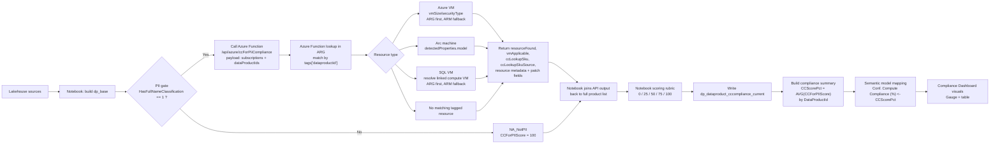

# Solution Modules

Use this folder as the primary implementation journey for scoped solution modules.

This location is designed to grow over time. Each module should have:
- A dedicated folder named `module-<n>-<solution-name>`
- A short `README.md` in the module folder
- Clear scope boundaries (inputs, transforms, outputs, report surfaces)

## Module Catalog

| Module | Folder | Purpose | Status |
|---|---|---|---|
| Solution 2: Dashboard Hydration for Residency | `module-2-dashboard-hydration-residency` | End-to-end lineage of residency scoring into Compliance Dashboard visuals | Drafted |
| Solution 3: Dashboard Hydration for CC-for-PII | `module-3-dashboard-hydration-cc-pii` | End-to-end lineage of CC-for-PII scoring into Compliance Dashboard visuals | Drafted |

## Solution 2 Details: Dashboard Hydration for Residency

### Scope

This solution documents how residency compliance is hydrated from notebook processing into the `Compliance Dashboard` page visuals.

### Architecture Diagram

```mermaid
flowchart LR
	LH["Lakehouse sources"] --> BASE["Notebook: build dp_base"]
	BASE --> GLOSS["Glossary residency input<br/>from dp_dataproductresidency_gold.ResidencyRegion"]
	GLOSS --> RULES["Approved region lookup<br/>rs_approved_regions"]

	BASE --> CALL["Call Azure Function<br/>/api/azure/residencyCompliance<br/>payload: subscriptions + dataProductIds"]
	CALL --> ARG["Resource Graph lookup by tag<br/>tags['dataproductid']<br/>(plus DataProductID/DataProductId variants)"]
	ARG --> AZ["Return resourceFound, resourceCount,<br/>locations[], resources[]"]
	AZ --> S3{"Is S3 product and no Azure resource?"}
	S3 -- Yes --> AWS["Fallback call<br/>/api/azure/residencyComplianceAws<br/>bucket location -> AzureLocations"]
	S3 -- No --> JOIN
	AWS --> JOIN["Join API/fallback output back to full product list"]

	RULES --> SCORE["Notebook residency scoring<br/>0 / 25 / 50 / 75 / 100"]
	JOIN --> SCORE

	SCORE --> RES["Write dp_dataproduct_residencycompliance_current"]
	RES --> SUMM["Build compliance summary<br/>ResidencyScorePct = AVG(ResidencyScorePct)<br/>by DataProductId"]
	SUMM --> MODEL["Semantic model mapping<br/>Residency Compliance (%) <- ResidencyScorePct"]
	MODEL --> DASH["Compliance Dashboard visuals<br/>Residency gauge + table"]
```

### Data Product Applicability and Selection Criteria

The residency block evaluates the full data product list, then scores each row using resource lookup plus glossary/rules evaluation.

Selection and enrichment logic:
- Base products come from `dp_base` (derived from `dp_dataproductresidency_gold`).
- Glossary residency input comes from `ResidencyRegion` in that base set.
- Approved-region validation comes from `rs_approved_regions` (code/name + approved flag).
- Notebook calls `/api/azure/residencyCompliance` for all data products.
- The function resolves resources via Resource Graph using `tags['dataproductid']` and also supports `tags['DataProductID']` / `tags['DataProductId']` variants.
- If the product is S3 and Azure resource lookup is empty, notebook calls `/api/azure/residencyComplianceAws` to derive bucket location and feeds that into the same scoring path.

### Residency Scoring Rubric (clarified)

| Outcome | Exact condition | Score | Meaning |
|---|---|---:|---|
| `NotFound` | `AzureResourceFound == false` | 0 | No associated Azure resource and no valid S3 fallback location found |
| `MissingGlossaryResidency` | `AzureResourceFound == true` and `GlossaryResidencyMissing == true` | 25 | Resource exists, but Purview glossary residency is missing/blank/unknown |
| `UnapprovedGlossaryResidency` | `AzureResourceFound == true` and `GlossaryResidencyMissing == false` and `IsApprovedResidency == false` | 50 | Glossary residency is present but not in approved region rules |
| `ApprovedButMismatched` | `AzureResourceFound == true` and `IsApprovedResidency == true` and `AzureLocationMatch == false` | 75 | Residency is approved but does not match detected resource location |
| `Compliant` | `AzureResourceFound == true` and `IsApprovedResidency == true` and `AzureLocationMatch == true` | 100 | Resource found, glossary residency approved, and strict location match achieved |

Strict match rule used by notebook:
- `AzureLocationMatch` is true only when normalized `AzureLocations` equals normalized `GlossaryResidencyRegionCode`.

### Dashboard roll-up mapping

- Per-product score is written as `ResidencyScorePct` in `dp_dataproduct_residencycompliance_current`.
- Compliance summary derives `ResidencyScorePct = AVG(ResidencyScorePct)` per `DataProductId`.
- Semantic model maps this to `Residency Compliance (%)`.
- Compliance Dashboard residency gauge uses `Average of Residency Compliance (%)`, and the table shows `Residency Compliance (%)` per data product.

## Solution 3 Details: Dashboard Hydration for CC-for-PII

### Scope

This solution documents how Confidential Compute for PII (CC-for-PII) is hydrated from notebook processing into the `Compliance Dashboard` page visuals.

### Architecture Diagram

### Data Product Applicability (PII gate)

The notebook confirms PII applicability from table `dp_dataproduct_fullnameclassification_current` and uses these fields:
- `HasFullNameClassification`
- `FullNameColumnCount`

It then derives:
- `CCApplicable = (HasFullNameClassification == 1)`

Behavior:
- `CCApplicable = true`: data product is sent to the CC endpoint for evaluation.
- `CCApplicable = false`: data product is still retained in output as `NA_NotPII` with score `100`.

### Azure Function lookup key

The Azure Function performs Resource Graph lookup using the Azure resource tag key:
- `tags['dataproductid']`

It matches resources against the incoming `dataProductIds` and applies supported-type logic for:
- Azure VM
- Arc machine
- SQL VM (using linked compute VM)

### CC Scoring Rubric (clarified)

| Outcome | Exact condition | Score | Meaning |
|---|---|---:|---|
| `NA_NotPII` | `CCApplicable == false` | 100 | Out of CC scope because product is not PII-applicable |
| `NotFound` | `resourceFound == false` | 0 | No matching tagged Azure resource found |
| `NA_NotApplicable` | `resourceFound == true` and `vmApplicable == false` | 100 | Resource exists but not in supported CC compute scope |
| Applicable, Azure VM lookup missing | `resourceFound == true` and `vmApplicable == true` and Azure VM lookup SKU missing | 25 | In-scope Azure VM but VM size lookup unavailable |
| Applicable, Arc model missing | `resourceFound == true` and `vmApplicable == true` and Arc lookup model missing | 50 | In-scope Arc resource but model unavailable |
| Applicable, non-confidential SKU/model | `IsConfidentialSku == false` | 50 | Resource is in scope but not running confidential compute |
| Applicable, confidential but unapproved | `IsConfidentialSku == true` and `IsApprovedSkuCalc == false` | 75 | Confidential compute detected but not approved |
| Applicable, confidential and approved | `IsConfidentialSku == true` and `IsApprovedSkuCalc == true` | 100 | Fully compliant confidential compute posture |

### Dashboard roll-up mapping

- Per-product score is written as `CCForPIIScore` in `dp_dataproduct_cccompliance_current`.
- Compliance summary derives `CCScorePct = AVG(CCForPIIScore)` per `DataProductId`.
- Semantic model maps `CCScorePct` to `Conf. Compute Compliance (%)`.
- Compliance Dashboard gauge and table visuals render from that mapped score.
