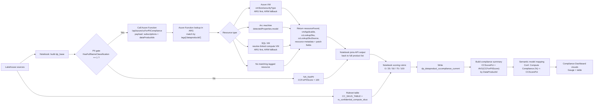

# Solution Modules

Use this folder as the primary implementation journey for scoped solution modules.

This location is designed to grow over time. Each module should have:
- A dedicated folder named `solution-module-<n>-<solution-name>`
- A short `README.md` in the module folder
- Clear scope boundaries (inputs, transforms, outputs, report surfaces)

## Module Catalog

| Module | Folder | Purpose | Status |
|---|---|---|---|
| Solution 2: Dashboard Hydration for Residency | `solution-module-2-dashboard-hydration-residency` | End-to-end lineage of residency scoring into Compliance Dashboard visuals | Drafted |
| Solution 3: Dashboard Hydration for CC-for-PII | `solution-module-3-dashboard-hydration-cc-pii` | End-to-end lineage of CC-for-PII scoring into Compliance Dashboard visuals | Drafted |
| Solution 5: CC-for-PII Compliance via Agent | `solution-module-5-cc-pii-compliance-via-agent` | End-to-end lineage of the Copilot topic and Power Automate flows that identify one eligible CC/PII resource and apply the investigation tag | Drafted |

## Solution Module 2 Details: Dashboard Hydration for Residency

### Scope

This solution documents how residency compliance is hydrated from notebook processing into the `Compliance Dashboard` page visuals.

### Architecture Diagram

```mermaid
flowchart LR
	LH["Lakehouse sources"] --> BASE["Notebook: build dp_base"]
	BASE --> GLOSS["Glossary residency input<br/>from dp_dataproductresidency_gold.ResidencyRegion"]
	GLOSS --> RULES["Approved region lookup<br/>rs_approved_regions"]

	BASE --> CALL["Call Azure Function<br/>/api/azure/residencyCompliance<br/>payload: subscriptions + dataProductIds"]
	CALL --> ARG["Resource Graph lookup by tag<br/>tags['dataproductid']<br/>(plus DataProductID/DataProductId variants)"]
	ARG --> AZ["Return resourceFound, resourceCount,<br/>locations[], resources[]"]
	AZ --> S3{"Is S3 product and no Azure resource?"}
	S3 -- Yes --> AWS["Fallback call<br/>/api/azure/residencyComplianceAws<br/>bucket location -> AzureLocations"]
	S3 -- No --> JOIN
	AWS --> JOIN["Join API/fallback output back to full product list"]

	RULES --> SCORE["Notebook residency scoring<br/>0 / 25 / 50 / 75 / 100"]
	JOIN --> SCORE

	SCORE --> RES["Write dp_dataproduct_residencycompliance_current"]
	RES --> SUMM["Build compliance summary<br/>ResidencyScorePct = AVG(ResidencyScorePct)<br/>by DataProductId"]
	SUMM --> MODEL["Semantic model mapping<br/>Residency Compliance (%) <- ResidencyScorePct"]
	MODEL --> DASH["Compliance Dashboard visuals<br/>Residency gauge + table"]
```

### Data Product Applicability and Selection Criteria

The residency block evaluates the full data product list, then scores each row using resource lookup plus glossary/rules evaluation.

Selection and enrichment logic:
- Base products come from `dp_base` (derived from `dp_dataproductresidency_gold`).
- Glossary residency input comes from `ResidencyRegion` in that base set.
- Approved-region validation comes from `rs_approved_regions` (code/name + approved flag).
- Notebook calls `/api/azure/residencyCompliance` for all data products.
- The function resolves resources via Resource Graph using `tags['dataproductid']` and also supports `tags['DataProductID']` / `tags['DataProductId']` variants.
- If the product is S3 and Azure resource lookup is empty, notebook calls `/api/azure/residencyComplianceAws` to derive bucket location and feeds that into the same scoring path.

### Residency Scoring Rubric (clarified)

| Outcome | Exact condition | Score | Meaning |
|---|---|---:|---|
| `NotFound` | `AzureResourceFound == false` | 0 | No associated Azure resource and no valid S3 fallback location found |
| `MissingGlossaryResidency` | `AzureResourceFound == true` and `GlossaryResidencyMissing == true` | 25 | Resource exists, but Purview glossary residency is missing/blank/unknown |
| `UnapprovedGlossaryResidency` | `AzureResourceFound == true` and `GlossaryResidencyMissing == false` and `IsApprovedResidency == false` | 50 | Glossary residency is present but not in approved region rules |
| `ApprovedButMismatched` | `AzureResourceFound == true` and `IsApprovedResidency == true` and `AzureLocationMatch == false` | 75 | Residency is approved but does not match detected resource location |
| `Compliant` | `AzureResourceFound == true` and `IsApprovedResidency == true` and `AzureLocationMatch == true` | 100 | Resource found, glossary residency approved, and strict location match achieved |

Strict match rule used by notebook:
- `AzureLocationMatch` is true only when normalized `AzureLocations` equals normalized `GlossaryResidencyRegionCode`.

### Dashboard roll-up mapping

- Per-product score is written as `ResidencyScorePct` in `dp_dataproduct_residencycompliance_current`.
- Compliance summary derives `ResidencyScorePct = AVG(ResidencyScorePct)` per `DataProductId`.
- Semantic model maps this to `Residency Compliance (%)`.
- Compliance Dashboard residency gauge uses `Average of Residency Compliance (%)`, and the table shows `Residency Compliance (%)` per data product.

## Solution Module 3 Details: Dashboard Hydration for CC-for-PII

### Scope

This solution documents how Confidential Compute for PII (CC-for-PII) is hydrated from notebook processing into the `Compliance Dashboard` page visuals.

### Architecture Diagram

### Data Product Applicability (PII gate)

The notebook confirms PII applicability from table `dp_dataproduct_fullnameclassification_current` and uses these fields:
- `HasFullNameClassification`
- `FullNameColumnCount`

It then derives:
- `CCApplicable = (HasFullNameClassification == 1)`

Ruleset lookup used by notebook scoring:
- `CC_SKUS_TABLE = "rs_confidential_compute_skus"`
- This table is joined by normalized lookup SKU/model (`LookupSku_lc`) to determine:
	- `IsConfidentialSku`
	- `IsApprovedSkuCalc`

Behavior:
- `CCApplicable = true`: data product is sent to the CC endpoint for evaluation.
- `CCApplicable = false`: data product is still retained in output as `NA_NotPII` with score `100`.

### Azure Function lookup key

The Azure Function performs Resource Graph lookup using the Azure resource tag key:
- `tags['dataproductid']`

It matches resources against the incoming `dataProductIds` and applies supported-type logic for:
- Azure VM
- Arc machine
- SQL VM (using linked compute VM)

### CC Scoring Rubric (clarified)

| Outcome | Exact condition | Score | Meaning |
|---|---|---:|---|
| `NA_NotPII` | `CCApplicable == false` | 100 | Out of CC scope because product is not PII-applicable |
| `NotFound` | `resourceFound == false` | 0 | No matching tagged Azure resource found |
| `NA_NotApplicable` | `resourceFound == true` and `vmApplicable == false` | 100 | Resource exists but not in supported CC compute scope |
| Applicable, Azure VM lookup missing | `resourceFound == true` and `vmApplicable == true` and Azure VM lookup SKU missing | 25 | In-scope Azure VM but VM size lookup unavailable |
| Applicable, Arc model missing | `resourceFound == true` and `vmApplicable == true` and Arc lookup model missing | 50 | In-scope Arc resource but model unavailable |
| Applicable, non-confidential SKU/model | `IsConfidentialSku == false` | 50 | Resource is in scope but not running confidential compute |
| Applicable, confidential but unapproved | `IsConfidentialSku == true` and `IsApprovedSkuCalc == false` | 75 | Confidential compute detected but not approved |
| Applicable, confidential and approved | `IsConfidentialSku == true` and `IsApprovedSkuCalc == true` | 100 | Fully compliant confidential compute posture |

How the ruleset affects scoring:
- If lookup SKU/model does not exist in `rs_confidential_compute_skus`, notebook treats it as non-confidential (`IsConfidentialSku = false`) and scores `50` when applicable.
- If it exists with approved flag false, notebook scores `75`.
- If it exists with approved flag true, notebook scores `100`.

### Dashboard roll-up mapping

- Per-product score is written as `CCForPIIScore` in `dp_dataproduct_cccompliance_current`.
- Compliance summary derives `CCScorePct = AVG(CCForPIIScore)` per `DataProductId`.
- Semantic model maps `CCScorePct` to `Conf. Compute Compliance (%)`.
- Compliance Dashboard gauge and table visuals render from that mapped score.

## Solution Module 5 Details: CC-for-PII Compliance via Agent

### Scope

This solution documents how the Copilot topic `Apply PII CC Investigate Tag` uses Power Automate flows plus the semantic model investigation table to turn CC-for-PII scoring into a guarded investigation and tagging action.

### Architecture Diagram

```mermaid
flowchart LR
	NB["Notebook CC block<br/>builds CCForPIIScore per data product"] --> CURR["Write dp_dataproduct_cccompliance_current"]
	CURR --> INV["Semantic model investigation table<br/>dp_dataproduct_cccompliance_investigate_current"]
	INV --> REPORT["Compliance Investigation page<br/>table of candidate CC/PII findings"]

	TOPIC["Copilot topic<br/>Apply PII CC Investigate Tag"] --> ASK["Prompt user for data product name"]
	ASK --> FLOW1["Flow: Retrieve_CCPII_Eligibility"]
	FLOW1 --> MATCH["Power BI query 1<br/>resolve a single product from Data Products"]
	MATCH --> ELIG["Power BI query 2<br/>filter dp_dataproduct_cccompliance_investigate_current"]
	ELIG --> CHECK{"verified match<br/>and exactly 1 eligible resource?"}

	CHECK -- No --> STOP["Return preview message<br/>No action taken"]
	CHECK -- Yes --> PREVIEW["Return preview fields<br/>ownerEmail, resourceId, ccScorePct,<br/>tagKey, tagValue"]
	PREVIEW --> CONFIRM["Topic asks for user confirmation"]
	CONFIRM --> FLOW2["Flow: Apply_CCPII_Tag_And_Notify"]
	FLOW2 --> API["Custom connector action<br/>CCPII_ApplyInvestigateTag"]
	FLOW2 --> TEAMS["Post Teams adaptive card"]
	API --> DONE["Investigation tag applied"]
```

### Topic and Flow Interaction Model

The topic is the orchestration layer and the flows hold the enforcement logic.

Conversation sequence:
- Topic asks the user for a data product name.
- Topic calls `Retrieve_CCPII_Eligibility` with that free-text input.
- The retrieve flow resolves the product, checks investigation eligibility, and returns a preview payload.
- Topic proceeds only when `verifiedMatch = true` and `eligibleCount = 1`.
- Topic shows the preview message and asks for explicit confirmation.
- If confirmed, topic calls `Apply_CCPII_Tag_And_Notify` with the returned resource and tag payload.

### Retrieve_CCPII_Eligibility flow logic

The retrieve flow is a two-stage Power BI lookup against dataset `8f7aded9-493f-45fe-8697-36b0145879d1`.

Stage 1: resolve a single data product
- Trigger input is one field: `text` with title `dataProductName`.
- Flow queries the semantic model `Data Products` table.
- If exactly one row is returned, it sets:
	- `varVerifiedMatch = true`
	- `varDataProductId`
	- `varDataProductDisplayName`
- If not, it returns a preview message asking the user for the exact name or ID.

Important exported-flow observation:
- The first DAX query currently searches for the hard-coded string `S/4` in `Name`, `Description`, or `Residency` rather than using the trigger text.
- Based on the export, this looks like a stale test query or implementation bug in the current flow definition.

Stage 2: filter the investigation table
- After a verified match, flow builds a second DAX query against `dp_dataproduct_cccompliance_investigate_current`.
- It filters to rows where:
	- `DataProductId = resolved product id`
	- `InvestigationRequired = TRUE()`
	- `CCScorePct IN {50, 75}`
	- `ResourceFound = TRUE()`
	- `HasFullNameClassification = 1`
	- `FullNameColumnCount > 0`
- It returns these projected fields:
	- `resourceId`
	- `ownerEmail`
	- `ccScorePct`
	- `tagKey`
	- `tagValue`

Eligibility handling:
- `eligibleCount` is set to the number of returned rows.
- `eligibleResourcesJson` stores the full returned row set as a string.
- If `eligibleCount = 1`, the flow sets a positive preview message and extracts the first row into:
	- `ownerEmail`
	- `tagKey`
	- `tagValue`
	- `ccScorePct`
	- `resourceId`
- If `eligibleCount != 1`, the flow returns a preview message stating that no action will be taken from the topic.

### Apply_CCPII_Tag_And_Notify flow logic

The apply flow is the write path and receives these inputs from the topic:
- `dataProductId`
- `dataProductDisplayName`
- `ownerEmail`
- `tagKey`
- `tagValue`
- `resourceId`
- `ccScorePct`

Execution behavior:
- Generates a request id with prefix `ccpii-`.
- Calls the custom connector operation `CCPII_ApplyInvestigateTag` with:
	- `dryRun = false`
	- `confirm = true`
	- `requestSource = CopilotStudio`
	- one `items[]` entry containing the resource id, score, owner email, and tag payload
- Posts a Teams adaptive card summarizing the action.
- Returns success fields back to the topic for the final user message.

### Relationship to notebook scoring and report surfaces

Module 5 depends on the upstream notebook and semantic model rather than recomputing compliance inside the flow.

Dependency chain:
- Notebook writes `dp_dataproduct_cccompliance_current` using the CC-for-PII rubric.
- Semantic model exposes `dp_dataproduct_cccompliance_investigate_current` as the agent-facing investigation queue.
- The Compliance Investigation report page shows the same candidate set for human review.
- The retrieve flow reads that model to decide whether the topic can offer the tagging action.

This means the agent conversation is downstream of the dashboard hydration logic:
- Module 3 creates the CC/PII score and investigation candidate state.
- Module 5 consumes that state and turns a single eligible candidate into a governed action.

### Agent-side eligibility rule summary

For the topic to proceed to confirmation, all of the following must be true:
- The retrieve flow can verify exactly one product match.
- The investigation table returns exactly one eligible resource row.
- The row is already scoped to PII-relevant products (`HasFullNameClassification = 1`, `FullNameColumnCount > 0`).
- The row is already scoped to actionable CC scores (`CCScorePct` of `50` or `75`).
- The row has a found resource and suggested tag payload.

This is intentionally narrower than the full CC dashboard population. The topic is designed for a safe single-resource investigation action, not for broad analytical exploration.
