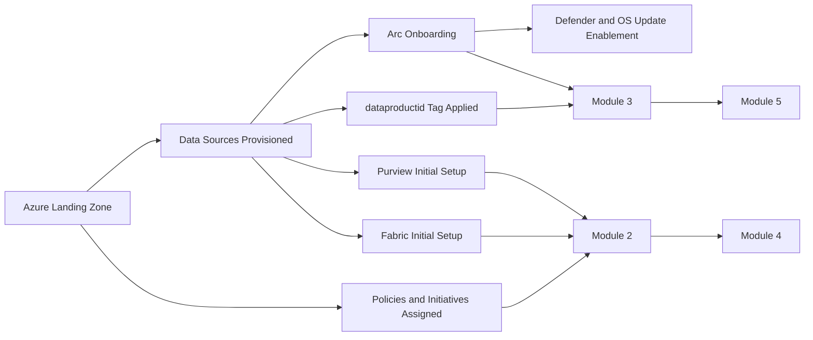

# Solution Module 1: Foundational

## Prerequisite

None. This is the baseline module for the rest of the solution modules.

Completion of this module is required before modules 2, 3, 4, and 5.

## Architecture Diagram

## Building Blocks

| Building Block | Details | Owner | Notes |
|---|---|---|---|
| Azure landing zone |  |  |  |
| creation of data sources |  |  |  |
| purview initial setup |  |  |  |
| fabric initial setup |  |  |  |
| arc onboarding |  |  |  |
| defender and os updates are enabled through arc for respective data sources |  |  |  |
| azure policies |  |  |  |
| initiatives |  |  |  |
| policies and assignements enforcing required tags |  |  |  |
| dataproductid tag is added to the data sources |  |  |  |

## Build Instructions

> **To be completed.** Detailed build instructions for Module 1 will be added in a future iteration. This section will cover step-by-step guidance for provisioning the Azure landing zone, onboarding Arc-enabled data sources, configuring Purview and Fabric workspaces, assigning policies and initiatives, and applying the `dataproductid` tag — all of which are prerequisites for modules 2 through 5.

## Testing

- Validate Arc connection status for onboarded data sources.
- Validate required tags (especially `dataproductid`) are present on scoped resources.
- Validate policies and initiatives show expected compliance states.
- Validate Purview and Fabric connectivity from the target workspace.

## Comments

- Module dependency map:
	- Module 2 depends on Module 1.
	- Module 3 depends on Module 1.
	- Module 4 depends on Modules 1 and 2.
	- Module 5 depends on Modules 1 and 3.