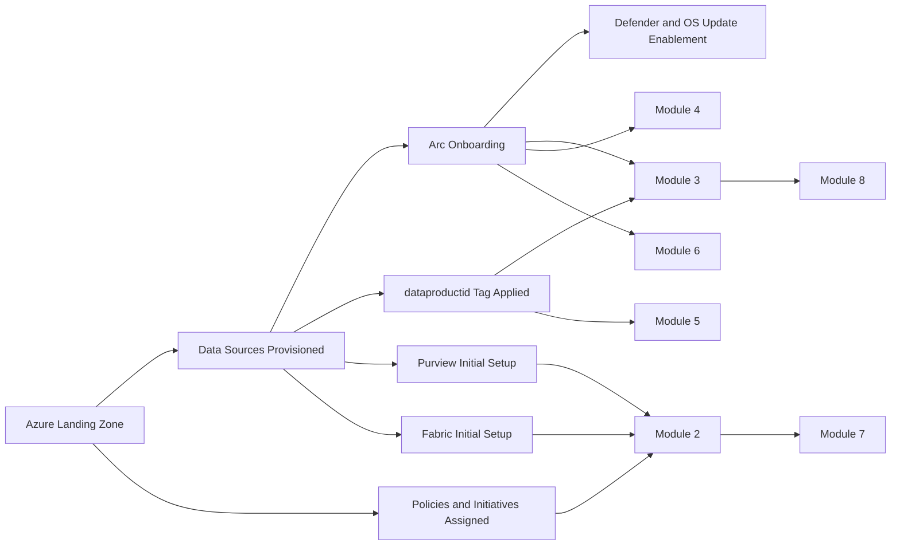

# Solution Module 1: Foundational

## Prerequisite

None. This is the baseline module for the rest of the solution modules.

Completion of this module is required before modules 2 through 8.

## Architecture Diagram

## Building Blocks

| Building Block | Details | Owner | Notes |
|---|---|---|---|
| Azure landing zone |  |  |  |
| creation of data sources |  |  |  |
| purview initial setup |  |  |  |
| fabric initial setup |  |  |  |
| arc onboarding |  |  |  |
| defender and os updates are enabled through arc for respective data sources |  |  |  |
| azure policies |  |  |  |
| initiatives |  |  |  |
| policies and assignements enforcing required tags |  |  |  |
| dataproductid tag is added to the data sources |  |  |  |

## Build Instructions

The following steps establish the shared baseline that modules 2 through 8 assume already exists.

### 1. Prepare environment configuration from shared templates

1. Copy `shared/templates/base/env.template` and `shared/templates/base/config.template.json` into environment-specific local files outside source control.
2. Populate tenant, subscription, region, workspace, function app, and Purview values for your target environment.
3. Keep secrets out of repo files; store only sanitized examples in source control.

### 2. Provision landing-zone and resource scopes

1. Define management-group/subscription/resource-group boundaries for platform and workload resources.
2. Create resource groups for at least:
	- Function hosting
	- Key Vault and identity resources
	- Data source and Arc-connected resources
	- Monitoring/logging
3. Apply baseline naming conventions so resource IDs and diagnostics remain consistent across modules.

### 3. Create core identities and role assignments

1. Create service principal for compliance API calls (used by Fabric notebooks), for example `spn-func-compliance-check`.
2. Create service principal for Purview data-plane operations (used by residency read/preview/apply paths), for example `spn-purview-contoso`.
3. Grant least-privilege roles required for downstream modules:
	- Resource Graph / Reader scope access for scoring routes
	- Tag write permissions for investigate-tag apply path (module 8)
	- Purview Data Curator for glossary update path (module 7)
4. Record all app IDs/tenant IDs in your local environment config.

### 4. Deploy Key Vault and wire secrets

1. Deploy Key Vault (for example `kv-purview-sap`) in the shared platform scope.
2. Add required secrets referenced by notebooks and function app:
	- `Secret-for-spn-func-compliance-check`
	- `<PURVIEW_SP_SECRET_NAME>` (for example, `Secret-for-purview-sp`)
3. Grant the Fabric notebook execution identity `Key Vault Secrets User` on the vault.
4. Configure function app Key Vault references for secrets instead of plain-text app settings.

### 5. Onboard data sources and Arc baseline

1. Onboard in-scope compute/data assets (Azure VM, Arc-enabled servers, SQL VM/S3-related sources as applicable to your environment).
2. Ensure Arc-connected machines are healthy and reporting in Azure Arc.
3. Validate Arc inventory evidence against shared artifacts under `shared/infra/arc/` (machine metadata, extensions, policy state summaries).
4. Enable Defender and patch-assessment telemetry on Arc/VM assets that will participate in modules 4 and 6.

### 6. Apply required tags at source

1. Apply `dataproductid` to in-scope resources; this tag is mandatory for all hydration and agent flows.
2. Apply governance tags used by tag scoring where applicable (`resource-origin`, `sovereignty-zone`).
3. Standardize tag key casing and value format before policy enforcement to avoid false non-compliance.

### 7. Assign shared policies and initiatives

1. Deploy and assign baseline policy artifacts from `shared/azure-policies/`:
	- `initiative-sovereignty-tagging.sanitized.json`
	- `initiative-origin-tagging.sanitized.json`
	- `initiative-audit-mi-kv-access.sanitized.json`
	- `policy-sovereignty-standard-azure-vm.sanitized.json`
	- `policy-sovereignty-comprehensive-arc.sanitized.json`
	- `policy-origin-tag-azure-vm.sanitized.json`
	- `policy-origin-tag-arc-machine.sanitized.json`
2. Scope assignments to the same subscriptions used by module pipelines.
3. Run/trigger policy evaluation and confirm expected compliance results before starting module hydration.

### 8. Configure Purview baseline

1. Create or validate the Purview account and collection hierarchy used by this solution.
2. Ensure required glossary structure exists for residency terms (including parent term expected by APIs).
3. Enable and validate Purview metadata export (SSA/DomainModel) so downstream notebook ingestion has source data.
4. Verify service principals used by functions have required Purview permissions.

### 9. Configure Fabric baseline

1. Create shared Fabric workspace and Lakehouse for the solution.
2. Grant workspace access to engineering, reporting, and automation identities.
3. Import notebooks used by downstream hydration modules (from shared artifacts):
	- Purview export to gold notebook
	- Compliance checks notebook
4. Confirm Synapse Spark runtime availability and workspace capacity settings.

### 10. Deploy shared function app baseline

1. Deploy `shared/functions/azure-functions/func-purv-contoso/`.
2. Confirm all required routes are present and reachable with Entra-authenticated calls:
	- `/api/azure/residencyCompliance`
	- `/api/azure/residencyComplianceAws`
	- `/api/azure/ccForPiiCompliance`
	- `/api/azure/defenderCompliance`
	- `/api/azure/tagCompliance`
	- `/api/azure/ccPiiInvestigateTagApply`
	- `/api/purview/residency`
	- `/api/purview/residencyUpdatePreview`
	- `/api/purview/residencyUpdateApply`
3. Configure required baseline app settings (`RESOURCE_GRAPH_API_VERSION`, `AZURE_SUBSCRIPTIONS`, cross-tenant `ARM_TENANT_B_*` where needed, Purview endpoint settings, timeout settings).

### 11. Establish semantic model and report baseline

1. Import semantic model assets from `shared/semantic-model/fabric-model/`.
2. Validate model bindings to Lakehouse SQL endpoint and expected tables.
3. Prepare report workspace and bind report assets from `shared/reports/powerbi/` to the published semantic model.
4. Define dataset refresh schedule that aligns with pipeline cadence.

### 12. Establish orchestration baseline

1. Create Fabric pipeline baseline with notebook sequencing support (gold ingestion then compliance checks).
2. Define schedule windows aligned with Purview export availability.
3. Enable pipeline failure notifications and run-history retention.

### 13. Foundation readiness gate (must pass before modules 2-8)

1. Resource discovery check: tagged resources are discoverable via ARG using `dataproductid`.
2. Security check: notebook identity resolves Key Vault secrets successfully.
3. Function check: all baseline APIs return successful responses for sample payloads.
4. Data check: Lakehouse receives source/gold/compliance tables after a test run.
5. Reporting check: semantic model refresh succeeds and report visuals load with current data.

## Testing

- Validate Arc connection status for onboarded data sources.
- Validate required tags (especially `dataproductid`) are present on scoped resources.
- Validate policies and initiatives show expected compliance states.
- Validate Purview and Fabric connectivity from the target workspace.

## Comments

- Module dependency map:
	- Module 2 depends on Module 1.
	- Module 3 depends on Module 1.
	- Module 4 depends on Module 1.
	- Module 5 depends on Module 1.
	- Module 6 depends on Modules 1 and 3.
	- Module 7 depends on Modules 1 and 2.
	- Module 8 depends on Modules 1 and 3.