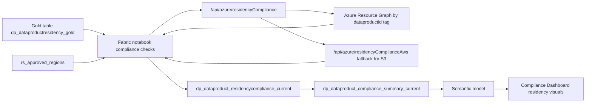

# Solution Module 2: Dashboard Hydration for Residency

## Prerequisite

- Module 1 must be completed.
- `dataproductid` tagging and policy baseline from Module 1 must be in place.
- Purview and Fabric baseline setup from Module 1 must be available.

## Architecture Diagram

## Building Blocks

| Component | Artifact | Role |
|---|---|---|
| Notebook | `notebook_fabric_function_sov_compliance_checks_new (5).ipynb` | Orchestrates residency scoring and writes current-state tables |
| Function API | `/api/azure/residencyCompliance` | Resolves Azure resource location signal using ARG and `dataproductid` tags |
| Function API fallback | `/api/azure/residencyComplianceAws` | Provides location fallback for S3-backed products when Azure resource is absent |
| Gold source table | `dp_dataproductresidency_gold` | Baseline data product and glossary residency input |
| Rules table | `rs_approved_regions` | Approved residency policy reference for scoring |
| Output table | `dp_dataproduct_residencycompliance_current` | Product-level residency compliance output |
| Reporting table | `dp_dataproduct_compliance_summary_current` | Aggregated score for dashboard consumption |

## Build Instructions

The following steps take you from a clean Module 1 foundation to a running Compliance Dashboard with live residency scores. Steps that reference `shared/` point to the corresponding folder in the repository.

### 1. Deploy the Azure Function App

1. Navigate to `shared/functions/azure-functions/` and follow the README for the `func-purv-contoso` function app.
2. Deploy the function app to Azure App Service (Python) targeting the same region as your data sources. The residency module needs these two routes active: `/api/azure/residencyCompliance` and `/api/azure/residencyComplianceAws`.
3. Enable Entra ID (EasyAuth) on the function app and record its **Application (client) ID** — this becomes your Function App audience (`api://<client-id>/.default`).
4. Create a service principal (`spn-func-compliance-check`) with a client secret. Store the secret in Azure Key Vault under secret name `Secret-for-spn-func-compliance-check`. Grant the SPN the function app's EasyAuth app role (or use client-credentials delegation).
5. Confirm both endpoints return `200` when called with a valid bearer token and a minimal JSON payload before proceeding.

### 2. Configure Key Vault access in Fabric

1. In the Fabric workspace, confirm the workspace managed identity (or the notebook execution identity) has `Key Vault Secrets User` role on the Key Vault `kv-purview-sap`.
2. This is required for `notebookutils.credentials.getSecret` to resolve `Secret-for-spn-func-compliance-check` at notebook runtime.

### 3. Import Notebook 1 — Purview to Gold

1. Upload `Refresh And Automate Purview parquet to gold.ipynb` (found in `shared/notebooks/`) into your Fabric Lakehouse as a Notebook item.
2. Attach the notebook to the target Lakehouse so all `saveAsTable` calls resolve to the correct managed Delta storage.
3. Set the notebook **runtime environment** to Synapse Spark (the default Fabric runtime); no additional library installs are required beyond `msal`, which the notebook installs inline.
4. Run the notebook manually end-to-end once to verify gold table creation. Confirm `dp_dataproductresidency_gold` exists in the Lakehouse and contains expected rows.

### 4. Import Notebook 2 — Compliance Checks

1. Upload `notebook_fabric_function_sov_compliance_checks_new (5).ipynb` (found in `shared/notebooks/`) into the same Fabric Lakehouse.
2. Attach to the same Lakehouse as Notebook 1.
3. In the notebook config block (Block 1), confirm the following variables match your deployment:
    - `TENANT_ID`: your Entra tenant ID
    - `CLIENT_ID`: the SPN client ID created in step 1.4
    - `FUNC_APP_BASE_URL`: your function app base URL (`https://<func-app-name>.azurewebsites.net`)
    - `AUDIENCE`: `api://<function-app-client-id>/.default`
    - `KV_NAME`: `kv-purview-sap`
    - `KV_SECRET_NAME`: `Secret-for-spn-func-compliance-check`
4. Run the residency scoring blocks only (Blocks 5–12 for residency, Block 13 for summary) to confirm `dp_dataproduct_residencycompliance_current` and `dp_dataproduct_compliance_summary_current` are written successfully.

### 5. Create Fabric Pipelines and schedule

1. In Fabric Data Factory, create a pipeline with two notebook activities in sequence: Notebook 1 (Purview-to-gold) → Notebook 2 (compliance checks).
2. Set schedule trigger to align with your Purview self-serve analytics (SSA) export cadence. If SSA exports run daily at 02:00 UTC, schedule the pipeline to start at 02:30 UTC to allow export completion.
3. Enable pipeline notifications for failed runs.

### 6. Connect the Semantic Model

1. Open the Fabric semantic model in `shared/semantic-model/fabric-model/` and import it into the Fabric workspace.
2. Set the data source connection to the Lakehouse where the Delta tables were written.
3. Bind the model to the Lakehouse SQL analytics endpoint (not the File endpoint) so it reads managed Delta tables.
4. Configure semantic model scheduled refresh to trigger after the pipeline completes. Use a refresh frequency that matches your pipeline cadence.

### 7. Connect the Power BI Report

1. Open the Compliance Dashboard `.pbix` or `.rdl` file in `shared/reports/powerbi/` (once published there; currently placeholder) in Power BI Desktop.
2. Update the data source connection to point to the published Fabric semantic model in your workspace.
3. Publish the report to the same Fabric workspace.
4. On the dashboard tile for **Residency Score** (`ResidencyScorePct`), pin it from the report. Set the tile to **auto-refresh** at a cadence not shorter than your semantic model refresh interval. Do not use live-query tile refresh if you want caching benefits — use a standard scheduled refresh on the semantic model instead.
5. Share the dataset and report with the compliance team per your organization's row-level security (RLS) requirements.

### 8. Validate end-to-end flow

1. Trigger the Purview SSA export for your collection.
2. Wait for the Fabric pipeline to complete both notebook runs.
3. Query `dp_dataproduct_residencycompliance_current` directly from the Lakehouse SQL endpoint and confirm rows show expected `ResidencyScore` and `ResidencyStatus` values.
4. Refresh the Power BI report manually and verify the Residency tile reflects updated `ResidencyScorePct`.
5. Confirm at least one data product exercised the S3 fallback path (if applicable) by checking for rows where the function called `/api/azure/residencyComplianceAws`.

## Testing

1. Run notebook residency block and verify `dp_dataproduct_residencycompliance_current` refreshes.
2. Validate score outputs for expected paths: `NotFound`, `MissingGlossaryResidency`, `ApprovedButMismatched`, `Compliant`.
3. Validate at least one S3 fallback case exercises `/api/azure/residencyComplianceAws`.
4. Validate dashboard visuals reflect updated `ResidencyScorePct` values.
5. Validate approved-region blocking behavior when region is outside `rs_approved_regions`.

## Comments

- Mapped to slide 27 in the PPT mapping you provided.
- Module 4 consumes the residency outputs and eligibility state from this module.