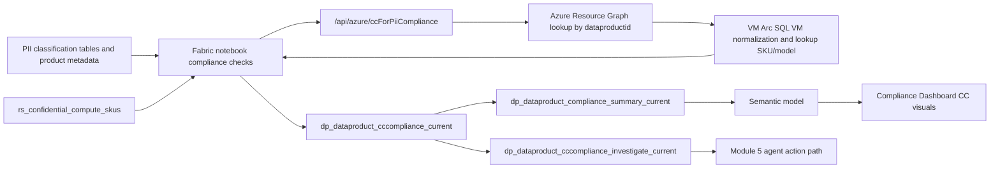

# Solution Module 3: Dashboard Hydration for CC-for-PII

## Prerequisite

- Module 1 must be completed.
- `dataproductid` tagging from Module 1 is required for ARG lookup.
- Full name classification tables must be available from the Fabric data prep path.

## Architecture Diagram

## Building Blocks

| Component | Artifact | Role |
|---|---|---|
| Notebook | `notebook_fabric_function_sov_compliance_checks_new (5).ipynb` | Computes CC-for-PII posture and investigation candidates |
| Function API | `/api/azure/ccForPiiCompliance` | Returns resource and compute metadata (VM/Arc/SQL VM) |
| Rules table | `rs_confidential_compute_skus` | Confidential and approved SKU/model policy source |
| PII gate table | `dp_dataproduct_fullnameclassification_current` | Determines `CCApplicable` path based on PII signal |
| Current output | `dp_dataproduct_cccompliance_current` | Product-level CC score and reasoning |
| Investigation output | `dp_dataproduct_cccompliance_investigate_current` | Candidate set for governed follow-up action |
| Reporting output | `dp_dataproduct_compliance_summary_current` | Dashboard-friendly rollup of scores |

## Testing

1. Validate PII gate behavior with products both in and out of `HasFullNameClassification` scope.
2. Validate ARG matching via `dataproductid` tag for VM and Arc resources.
3. Validate scoring outcomes for `NotFound`, `NA_NotPII`, `Applicable` non-confidential, and approved confidential SKUs.
4. Validate `dp_dataproduct_cccompliance_investigate_current` contains only actionable rows.
5. Validate Compliance Dashboard CC metrics align with `CCScorePct` in summary table.

## Comments

- Mapped to slide 28 in the PPT mapping you provided.
- Module 5 depends on this module because it consumes the investigation table and score outputs.