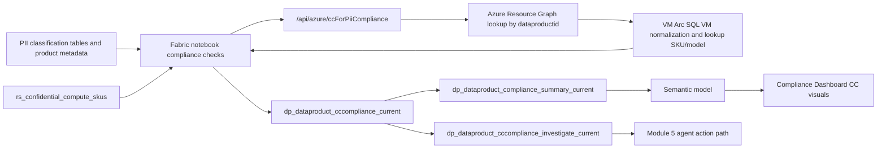

# Solution Module 3: Dashboard Hydration for CC-for-PII

## Prerequisite

- Module 1 must be completed.
- `dataproductid` tagging from Module 1 is required for ARG lookup.
- Full name classification tables must be available from the Fabric data prep path.

## Architecture Diagram

## Building Blocks

| Component | Artifact | Role |
|---|---|---|
| Notebook | `notebook_fabric_function_sov_compliance_checks_new (5).ipynb` | Computes CC-for-PII posture and investigation candidates |
| Function API | `/api/azure/ccForPiiCompliance` | Returns resource and compute metadata (VM/Arc/SQL VM) |
| Rules table | `rs_confidential_compute_skus` | Confidential and approved SKU/model policy source |
| PII gate table | `dp_dataproduct_fullnameclassification_current` | Determines `CCApplicable` path based on PII signal |
| Current output | `dp_dataproduct_cccompliance_current` | Product-level CC score and reasoning |
| Investigation output | `dp_dataproduct_cccompliance_investigate_current` | Candidate set for governed follow-up action |
| Reporting output | `dp_dataproduct_compliance_summary_current` | Dashboard-friendly rollup of scores |

## Build Instructions

The following steps take you from a clean Module 1 foundation to a running Compliance Dashboard with live CC-for-PII scores. Steps that reference `shared/` point to the corresponding folder in the repository.

### 1. Deploy the Azure Function App

1. Navigate to `shared/functions/azure-functions/` and follow the README for the `func-purv-contoso` function app.
2. Deploy the function app to Azure App Service (Python) in the same region as your compute/data resources. This module needs the `/api/azure/ccForPiiCompliance` route active.
3. Enable Entra ID (EasyAuth) on the function app and record its **Application (client) ID**.
4. Create or reuse the service principal `spn-func-compliance-check` from Module 2. Store its client secret in Key Vault under `Secret-for-spn-func-compliance-check`. The SPN must have the function app's EasyAuth app role.
5. Confirm `/api/azure/ccForPiiCompliance` returns `200` with a sample payload before proceeding.

### 2. Configure Key Vault access in Fabric

1. Verify the Fabric workspace execution identity has `Key Vault Secrets User` role on `kv-purview-sap` so `notebookutils.credentials.getSecret` can resolve `Secret-for-spn-func-compliance-check` at runtime.

### 3. Ensure PII classification data is available

1. The CC scoring path requires `dp_dataproduct_fullnameclassification_current` to exist in the Lakehouse. This table determines `CCApplicable` for each data product — products without a full-name classification are scored as `NA_NotPII`.
2. Verify this table exists and has at least a `DataProductName` and `HasFullNameClassification` column (or equivalent schema expected by Block 4 of Notebook 2). If it does not exist, populate it from your classification pipeline before running compliance scoring.

### 4. Import Notebook 1 — Purview to Gold (shared with Module 2)

1. If Notebook 1 (`Refresh And Automate Purview parquet to gold.ipynb` in `shared/notebooks/`) is already imported from Module 2, no re-import is needed — the same notebook populates `dp_dataproductresidency_gold` which is also the base product set used here.
2. If starting fresh, import and attach to the Fabric Lakehouse and run once to confirm all gold tables are present.

### 5. Import Notebook 2 — Compliance Checks

1. Upload `notebook_fabric_function_sov_compliance_checks_new (5).ipynb` (in `shared/notebooks/`) to the same Fabric Lakehouse if not already imported from Module 2.
2. Attach to the same Lakehouse.
3. In the notebook config block (Block 1), confirm:
    - `TENANT_ID`, `CLIENT_ID`, `AUDIENCE`, `FUNC_APP_BASE_URL`, `KV_NAME`, `KV_SECRET_NAME` match your deployment (see Module 2 Build Instructions step 4.3 for reference values).
4. To run only the CC-for-PII scoring path, execute Blocks 1–4 (setup + base data + PII applicability join) then Blocks 5–12 for the CC domain, and Block 13 for the summary. Confirm:
    - `dp_dataproduct_cccompliance_current` is written with expected `CCScore` and `CCStatus` columns.
    - `dp_dataproduct_cccompliance_investigate_current` contains only products with `CCScorePct` 50 or 75 where `CCApplicable = true`.
    - `dp_dataproduct_compliance_summary_current` has a `CCScorePct` aggregate column.
5. Set the notebook **runtime environment** to Synapse Spark (default Fabric runtime).

### 6. Create Fabric Pipelines and schedule

1. If a pipeline already exists from Module 2, extend it to ensure Notebook 2 runs both residency and CC blocks in sequence (they share the same notebook — no separate pipeline activity needed).
2. If building fresh: create a pipeline with Notebook 1 → Notebook 2 in sequence. Schedule to run after Purview SSA export completes.
3. The CC scoring path requires the gold base table from Notebook 1 (`dp_dataproductresidency_gold`), so Notebook 1 must always execute before Notebook 2.

### 7. Connect the Semantic Model

1. Open the Fabric semantic model in `shared/semantic-model/fabric-model/` and ensure it is already published in the workspace (shared with Module 2).
2. The CC compliance tables (`dp_dataproduct_cccompliance_current`, `dp_dataproduct_cccompliance_investigate_current`) must be included in the model's table list. If not present, edit the semantic model to add these tables and define relationships on `DataProductName` or equivalent key.
3. Confirm `CCScorePct` is exposed as a measure or column in the model for use in the dashboard visuals.

### 8. Connect the Power BI Report

1. Open the Compliance Dashboard report in `shared/reports/powerbi/` in Power BI Desktop.
2. Confirm the **CC-for-PII compliance** page or visuals consume `CCScorePct` from the semantic model.
3. Publish the updated report to the Fabric workspace.
4. On any dashboard tile pinned from the CC visuals page, configure the tile display to **not** override the semantic model refresh schedule. Let the semantic model refresh drive data freshness; the tile should reflect the latest cached value.
5. Validate that the `dp_dataproduct_cccompliance_investigate_current` table is accessible in the semantic model (this table is also consumed by Module 5).

### 9. Validate end-to-end flow

1. Trigger the Purview SSA export and wait for the pipeline to complete.
2. Query `dp_dataproduct_cccompliance_current` from the Lakehouse SQL endpoint. Confirm products with full-name classification show a `CCScore` result and products without it show `NA_NotPII`.
3. Query `dp_dataproduct_cccompliance_investigate_current` and confirm only actionable rows (50/75 score + PII scope) are present.
4. Refresh the report and verify the CC-for-PII compliance visual updates with the new scores.
5. Confirm the compliance summary tile shows an updated `CCScorePct` aggregation.

## Testing

1. Validate PII gate behavior with products both in and out of `HasFullNameClassification` scope.
2. Validate ARG matching via `dataproductid` tag for VM and Arc resources.
3. Validate scoring outcomes for `NotFound`, `NA_NotPII`, `Applicable` non-confidential, and approved confidential SKUs.
4. Validate `dp_dataproduct_cccompliance_investigate_current` contains only actionable rows.
5. Validate Compliance Dashboard CC metrics align with `CCScorePct` in summary table.

## Comments

- Mapped to slide 28 in the PPT mapping you provided.
- Module 5 depends on this module because it consumes the investigation table and score outputs.