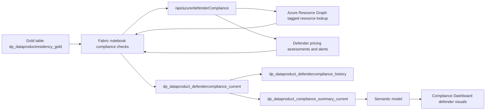

# Solution Module 4: Dashboard Hydration for Defender

## Prerequisite

- Module 1 must be completed.
- `dataproductid` tagging from Module 1 is required for ARG resource discovery.
- Arc onboarding baseline from Module 1 must be in place for hybrid compute assets.

## Architecture Diagram

## Building Blocks

| Component | Artifact | Role |
|---|---|---|
| Notebook | `notebook_fabric_function_sov_compliance_checks_new (5).ipynb` | Executes defender scoring and writes current/history compliance tables |
| Function API | `/api/azure/defenderCompliance` | Computes defender posture score from pricing, assessments, and alert evidence |
| Base table | `dp_dataproductresidency_gold` | Product-to-resource baseline used for scoring applicability |
| Current output | `dp_dataproduct_defendercompliance_current` | Product-level defender compliance snapshot |
| History output | `dp_dataproduct_defendercompliance_history` | Time-series defender posture history |
| Summary output | `dp_dataproduct_compliance_summary_current` | Aggregated table used by dashboard matrix/score visuals |
| Policy baseline | `shared/azure-policies/policy-sovereignty-comprehensive-arc.sanitized.json` | Baseline governance policy for Arc/hybrid resources included in compliance context |

## Build Instructions

The following steps take you from a clean Module 1 foundation to a running Compliance Dashboard with live Defender posture scores.

### 1. Deploy and configure function app

1. Navigate to `shared/functions/azure-functions/func-purv-contoso/` and deploy the function app.
2. Confirm the `azure_defender_compliance` function is present and exposed as `/api/azure/defenderCompliance`.
3. Enable Entra ID (EasyAuth) on the function app and capture the API audience as `api://<function-app-client-id>/.default`.
4. Configure app settings required by the defender route:
	- `RESOURCE_GRAPH_API_VERSION`
	- `AZURE_SUBSCRIPTIONS` (or pass subscriptions in request payload)
	- Optional cross-tenant settings when needed: `ARM_TENANT_B_TENANT_ID`, `ARM_TENANT_B_CLIENT_ID`, `ARM_TENANT_B_CLIENT_SECRET`, `ARM_TENANT_B_SUBSCRIPTIONS`
5. Store the function-app SPN secret in Key Vault `kv-purview-sap` under `Secret-for-spn-func-compliance-check` and confirm the SPN can call the protected endpoint.

### 2. Confirm defender control-plane readiness

1. In Defender for Cloud, ensure target subscriptions are onboarded and Defender plans are enabled for covered resource types.
2. Validate assessment and alert data is available in Defender/ARG (the function uses pricing, assessments, and active high-alert signals).
3. Ensure Arc-connected servers are healthy in Azure Arc so they are discoverable during scoring.

### 3. Import and configure compliance notebook

1. Upload `notebook_fabric_function_sov_compliance_checks_new (5).ipynb` to your Fabric workspace and attach it to the target Lakehouse.
2. In Block 1 config, verify tenant/client/function settings:
	- `TENANT_ID`
	- `CLIENT_ID`
	- `AUDIENCE`
	- `FUNC_APP_BASE_URL`
	- `KV_NAME`
	- `KV_SECRET_NAME`
3. Set runtime environment to Synapse Spark.
4. Run setup and helper blocks first, then execute the defender scoring block (`/api/azure/defenderCompliance`) and persistence blocks.

### 4. Validate table outputs

1. Confirm `dp_dataproduct_defendercompliance_current` is created/updated in the Lakehouse.
2. Confirm `dp_dataproduct_defendercompliance_history` appends on subsequent runs.
3. Confirm `dp_dataproduct_compliance_summary_current` reflects updated defender percentage columns used by reporting.

### 5. Configure orchestration and schedule

1. Add or update the Fabric pipeline so Notebook 1 (Purview to gold) runs before Notebook 2 (compliance checks).
2. Schedule the pipeline based on your Purview export cadence.
3. Enable pipeline run alerts for failure notifications.

### 6. Connect semantic model and report

1. In `shared/semantic-model/fabric-model/`, ensure defender tables are modeled and related by `DataProductId`.
2. Publish/refresh semantic model after notebook completion.
3. In `shared/reports/powerbi/`, bind defender visuals/tiles to the semantic model columns populated from `dp_dataproduct_defendercompliance_current` and `dp_dataproduct_compliance_summary_current`.
4. Align report and dashboard refresh cadence with semantic-model refresh (do not set tile cache refresh shorter than dataset refresh).

### 7. Validate end-to-end behavior

1. Trigger pipeline run.
2. Verify defender compliance rows are updated for expected products.
3. Confirm dashboard defender visuals update with latest percentages.
4. Validate at least one product traverses each expected score band (`0/25/50/75/100`) for rubric sanity.

## Testing

1. Validate endpoint `/api/azure/defenderCompliance` returns scores for known `dataproductid` inputs.
2. Validate non-applicable products are handled correctly (no false-positive defender failures).
3. Validate history append behavior across consecutive runs.
4. Validate summary-table defender metric equals expected aggregate from current table.
5. Validate dashboard visuals reflect updated defender values after semantic refresh.

## Comments

- Defender score logic is computed in the function route and persisted through the shared compliance notebook path.
- This module is hydration-only; no Copilot action orchestration is required.
