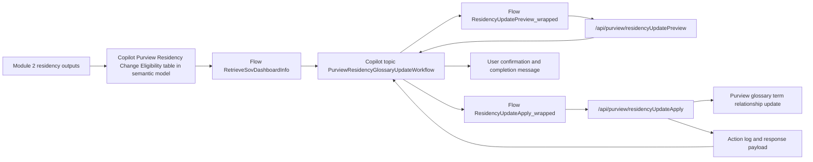

# Solution Module 4: Residency Compliance via Agent

## Prerequisite

- Module 1 must be completed.
- Module 2 must be completed because this module depends on residency scoring and eligibility outputs.

## Architecture Diagram

## Building Blocks

| Component | Artifact | Role |
|---|---|---|
| Copilot topic | `Default_contosoDataSovereigntyAssistant.topic.PurviewResidencyGlossaryUpdateWorkflow` | Conversation orchestration for residency update workflow |
| Dashboard retrieval flow | `RetrieveSovDashboardInfo-9A61C3B7-D309-F111-8406-6045BD08FD21.json` | Reads semantic model metrics and eligibility signals |
| Residency lookup flow | `FetchResidencyInfoFromPurview-EE876561-630B-F111-8406-6045BD08FD21.json` | Reads current Purview residency for a data product |
| Preview flow | `ResidencyUpdatePreview_wrapped-8DB5F7D4-170A-54B4-AC27-C8A12ABB4312.json` | Calls preview endpoint with dry-run conflict-safe checks |
| Apply flow | `ResidencyUpdateApply_wrapped-A674C7CD-E064-D2EA-A93E-BFAE5972604C.json` | Applies confirmed update through function endpoint |
| Custom connector | `new_purview-2dfunc-2dapp-2dcontoso_openapidefinition.json` | Exposes `GetResidency`, `ResidencyUpdatePreview`, `ResidencyUpdateApply` |
| Function endpoints | `/api/purview/residency`, `/api/purview/residencyUpdatePreview`, `/api/purview/residencyUpdateApply` | Backend implementation for read, preview, and apply paths |

## Build Instructions

The following steps take you from a completed Module 2 baseline to a working Copilot agent that can preview and apply Purview residency glossary updates on confirmed user request.

### 1. Deploy the Purview function app routes

1. Navigate to `shared/functions/azure-functions/func-purv-contoso/` and confirm the three Purview routes are included in your function app deployment: `/api/purview/residency`, `/api/purview/residencyUpdatePreview`, `/api/purview/residencyUpdateApply`.
2. The Purview routes require a separate service principal with **Data Curator** role on the Microsoft Purview collection. Create an SPN (e.g., `spn-purview-contoso`) and store its client secret in Key Vault under the secret name used by the function app (`Secret-for-Purview-SAP-SP-Moaz` per Notebook 1 reference). Grant this SPN the **Purview Data Curator** role at the root collection level.
3. Set the following environment variables (or App Settings) on the function app:
	- `PURVIEW_ACCOUNT_NAME`: your Purview account name (e.g., `ext-purview-moaz`)
	- `TENANT_ID`: your Entra tenant ID
	- `PURVIEW_SPN_CLIENT_ID`: the Purview SPN client ID
	- `PURVIEW_SPN_CLIENT_SECRET_KV_REF`: Key Vault reference expression pointing to the SPN secret
4. Redeploy the function app after setting environment variables
5. Test all three Purview endpoints directly with Postman/curl using a bearer token before proceeding to Power Platform configuration.

### 2. Import the custom connector

1. Navigate to `shared/power-platform/custom-connector/purview-func-app-contoso/` and open the OpenAPI definition JSON (`new_purview-2dfunc-2dapp-2dcontoso_openapidefinition.json`).
2. In the target Power Platform environment, go to **Custom connectors → New custom connector → Import an OpenAPI file**. Upload the definition.
3. On the **Security** tab, configure the connector authentication: use **OAuth 2.0**, set identity provider to **Azure Active Directory**, and enter the function app's EasyAuth client ID and the API audience (`api://<func-app-client-id>/.default`).
4. Test the connector by clicking **Test** on the `GetResidency` operation with a known data product name. Confirm you receive a non-error response.
5. Share the connector with the Copilot Studio maker account and the Power Automate connection needs.

### 3. Create Power Automate connections and import flows

1. In the Power Platform environment, create a **connection** for the custom connector imported in step 2. Use a service account or the maker account credentials.
2. Import each of the four flows from `shared/power-platform/flows/` in dependency order:
	1. `RetrieveSovDashboardInfo` — reads the semantic model measures; requires a **Power BI** connection pointing to the workspace and dataset from Module 2.
	2. `FetchResidencyInfoFromPurview` — reads current Purview residency; requires the custom connector connection.
	3. `ResidencyUpdatePreview_wrapped` — calls the preview endpoint; requires the custom connector connection.
	4. `ResidencyUpdateApply_wrapped` — calls the apply endpoint; requires the custom connector connection.
3. After importing each flow, open it and update the connection references (the import wizard will prompt you to map connections). Turn each flow **On** after mapping.
4. For `RetrieveSovDashboardInfo`, confirm the Power BI dataset reference points to the published semantic model from Module 2. Update the dataset ID in the flow's Power BI action if it shows a stale or placeholder reference.

### 4. Import the Copilot topic

1. Use the managed solution ZIP `copilotagentsolution_1_0_0_1_managed.zip` (in `shared/power-platform/solution-assets/`) or the individual topic XML from `shared/power-platform/copilot-agent/Topic/` as your import source. Prefer the managed solution ZIP for a clean environment.
2. In the Power Platform admin center, go to **Solutions → Import solution** and upload the ZIP.
3. During import, map the flow connection references for the four flows imported in step 3.
4. After import, open **Copilot Studio → your agent → Topics** and confirm `PurviewResidencyGlossaryUpdateWorkflow` (or `Default_contosoDataSovereigntyAssistant.topic.PurviewResidencyGlossaryUpdateWorkflow`) is present and active.
5. If importing from the topic XML directly (i.e., not using the managed solution), create the topic manually in Copilot Studio and paste the YAML content from the XML file.

### 5. Configure the Copilot agent

1. Ensure the agent is configured in **Copilot Studio** as a standalone agent or as part of your existing agent. The topic should appear under the agent's topic list.
2. Enable the flows as **tools** on the agent if the topic is registered as an agent tool/topic (check the topic YAML for `kind: Topic` vs `kind: AgentTool`). See `shared/power-platform/copilot-agent/README.md` for topic vs tool guidance.
3. Publish the agent to your target channel (Teams, SharePoint, or embedded web).

### 6. Validate the semantic model eligibility signal

1. Open the semantic model from Module 2 and confirm a measure or table called `PurviewResidencyChangeEligibility` (or equivalent) exists that surfaces data products eligible for a Purview glossary update.
2. The `RetrieveSovDashboardInfo` flow reads this measure. If the measure name differs in your model, update the Power BI action in the flow to match the exact measure/table name.
3. Confirm the semantic model has been refreshed at least once after the Module 2 pipeline ran, so eligibility rows are populated.

### 7. Validate end-to-end flow

1. Start a conversation with the agent in the target channel.
2. Trigger the `PurviewResidencyGlossaryUpdateWorkflow` topic by using its trigger phrases.
3. Confirm the agent calls `RetrieveSovDashboardInfo` and surfaces an eligible product.
4. Confirm the preview step returns a non-destructive preview payload with `needsChange=true` and the expected target region.
5. Confirm user confirmation gates the apply step — the apply call should not fire unless the user explicitly approves.
6. After confirming apply, verify in Purview that the glossary relationship for the target data product has been updated to the new residency.

## Testing

1. Use an eligible product and validate preview returns `needsChange=true` and expected target code.
2. Validate stale preview protection by changing current residency between preview and apply (expect conflict handling).
3. Validate no-op scenario where current equals target returns non-destructive success message.
4. Validate one full apply path updates Purview glossary relationship and returns applied confirmation.
5. Validate blocked unapproved-region path is surfaced correctly from eligibility retrieval flow.

## Comments

- Mapped to slide 29 in the PPT mapping you provided.
- This module is intentionally governed: preview first, explicit user confirmation, then apply.