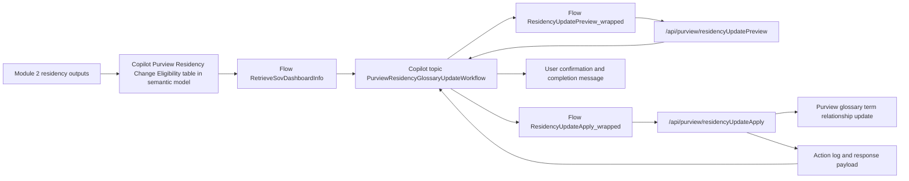

# Solution Module 4: Residency Compliance via Agent

## Prerequisite

- Module 1 must be completed.
- Module 2 must be completed because this module depends on residency scoring and eligibility outputs.

## Architecture Diagram

## Building Blocks

| Component | Artifact | Role |
|---|---|---|
| Copilot topic | `Default_contosoDataSovereigntyAssistant.topic.PurviewResidencyGlossaryUpdateWorkflow` | Conversation orchestration for residency update workflow |
| Dashboard retrieval flow | `RetrieveSovDashboardInfo-9A61C3B7-D309-F111-8406-6045BD08FD21.json` | Reads semantic model metrics and eligibility signals |
| Residency lookup flow | `FetchResidencyInfoFromPurview-EE876561-630B-F111-8406-6045BD08FD21.json` | Reads current Purview residency for a data product |
| Preview flow | `ResidencyUpdatePreview_wrapped-8DB5F7D4-170A-54B4-AC27-C8A12ABB4312.json` | Calls preview endpoint with dry-run conflict-safe checks |
| Apply flow | `ResidencyUpdateApply_wrapped-A674C7CD-E064-D2EA-A93E-BFAE5972604C.json` | Applies confirmed update through function endpoint |
| Custom connector | `new_purview-2dfunc-2dapp-2dcontoso_openapidefinition.json` | Exposes `GetResidency`, `ResidencyUpdatePreview`, `ResidencyUpdateApply` |
| Function endpoints | `/api/purview/residency`, `/api/purview/residencyUpdatePreview`, `/api/purview/residencyUpdateApply` | Backend implementation for read, preview, and apply paths |

## Testing

1. Use an eligible product and validate preview returns `needsChange=true` and expected target code.
2. Validate stale preview protection by changing current residency between preview and apply (expect conflict handling).
3. Validate no-op scenario where current equals target returns non-destructive success message.
4. Validate one full apply path updates Purview glossary relationship and returns applied confirmation.
5. Validate blocked unapproved-region path is surfaced correctly from eligibility retrieval flow.

## Comments

- Mapped to slide 29 in the PPT mapping you provided.
- This module is intentionally governed: preview first, explicit user confirmation, then apply.