# Solution Module 5: CC-for-PII Compliance via Agent

## Solution Module 5 Details: CC-for-PII Compliance via Agent

### Scope

This solution documents how the Copilot topic `Apply PII CC Investigate Tag` uses Power Automate flows plus the semantic model investigation table to turn CC-for-PII scoring into a guarded investigation and tagging action.

### Architecture Diagram

```mermaid
flowchart LR
	NB["Notebook CC block<br/>builds CCForPIIScore per data product"] --> CURR["Write dp_dataproduct_cccompliance_current"]
	CURR --> INV["Semantic model investigation table<br/>dp_dataproduct_cccompliance_investigate_current"]
	INV --> REPORT["Compliance Investigation page<br/>table of candidate CC/PII findings"]

	TOPIC["Copilot topic<br/>Apply PII CC Investigate Tag"] --> ASK["Prompt user for data product name"]
	ASK --> FLOW1["Flow: Retrieve_CCPII_Eligibility"]
	FLOW1 --> MATCH["Power BI query 1<br/>resolve a single product from Data Products"]
	MATCH --> ELIG["Power BI query 2<br/>filter dp_dataproduct_cccompliance_investigate_current"]
	ELIG --> CHECK{"verified match<br/>and exactly 1 eligible resource?"}

	CHECK -- No --> STOP["Return preview message<br/>No action taken"]
	CHECK -- Yes --> PREVIEW["Return preview fields<br/>ownerEmail, resourceId, ccScorePct,<br/>tagKey, tagValue"]
	PREVIEW --> CONFIRM["Topic asks for user confirmation"]
	CONFIRM --> FLOW2["Flow: Apply_CCPII_Tag_And_Notify"]
	FLOW2 --> API["Custom connector action<br/>CCPII_ApplyInvestigateTag"]
	FLOW2 --> TEAMS["Post Teams adaptive card"]
	API --> DONE["Investigation tag applied"]
```

### Topic and Flow Interaction Model

The topic is the orchestration layer and the flows hold the enforcement logic.

Conversation sequence:
- Topic asks the user for a data product name.
- Topic calls `Retrieve_CCPII_Eligibility` with that free-text input.
- The retrieve flow resolves the product, checks investigation eligibility, and returns a preview payload.
- Topic proceeds only when `verifiedMatch = true` and `eligibleCount = 1`.
- Topic shows the preview message and asks for explicit confirmation.
- If confirmed, topic calls `Apply_CCPII_Tag_And_Notify` with the returned resource and tag payload.

### Retrieve_CCPII_Eligibility flow logic

The retrieve flow is a two-stage Power BI lookup against dataset `8f7aded9-493f-45fe-8697-36b0145879d1`.

Stage 1: resolve a single data product
- Trigger input is one field: `text` with title `dataProductName`.
- Flow queries the semantic model `Data Products` table.
- If exactly one row is returned, it sets:
	- `varVerifiedMatch = true`
	- `varDataProductId`
	- `varDataProductDisplayName`
- If not, it returns a preview message asking the user for the exact name or ID.

Important exported-flow observation:
- The first DAX query currently searches for the hard-coded string `S/4` in `Name`, `Description`, or `Residency` rather than using the trigger text.
- Based on the export, this looks like a stale test query or implementation bug in the current flow definition.

Stage 2: filter the investigation table
- After a verified match, flow builds a second DAX query against `dp_dataproduct_cccompliance_investigate_current`.
- It filters to rows where:
	- `DataProductId = resolved product id`
	- `InvestigationRequired = TRUE()`
	- `CCScorePct IN {50, 75}`
	- `ResourceFound = TRUE()`
	- `HasFullNameClassification = 1`
	- `FullNameColumnCount > 0`
- It returns these projected fields:
	- `resourceId`
	- `ownerEmail`
	- `ccScorePct`
	- `tagKey`
	- `tagValue`

Eligibility handling:
- `eligibleCount` is set to the number of returned rows.
- `eligibleResourcesJson` stores the full returned row set as a string.
- If `eligibleCount = 1`, the flow sets a positive preview message and extracts the first row into:
	- `ownerEmail`
	- `tagKey`
	- `tagValue`
	- `ccScorePct`
	- `resourceId`
- If `eligibleCount != 1`, the flow returns a preview message stating that no action will be taken from the topic.

### Apply_CCPII_Tag_And_Notify flow logic

The apply flow is the write path and receives these inputs from the topic:
- `dataProductId`
- `dataProductDisplayName`
- `ownerEmail`
- `tagKey`
- `tagValue`
- `resourceId`
- `ccScorePct`

Execution behavior:
- Generates a request id with prefix `ccpii-`.
- Calls the custom connector operation `CCPII_ApplyInvestigateTag` with:
	- `dryRun = false`
	- `confirm = true`
	- `requestSource = CopilotStudio`
	- one `items[]` entry containing the resource id, score, owner email, and tag payload
- Posts a Teams adaptive card summarizing the action.
- Returns success fields back to the topic for the final user message.

### Relationship to notebook scoring and report surfaces

Module 5 depends on the upstream notebook and semantic model rather than recomputing compliance inside the flow.

Dependency chain:
- Notebook writes `dp_dataproduct_cccompliance_current` using the CC-for-PII rubric.
- Semantic model exposes `dp_dataproduct_cccompliance_investigate_current` as the agent-facing investigation queue.
- The Compliance Investigation report page shows the same candidate set for human review.
- The retrieve flow reads that model to decide whether the topic can offer the tagging action.

This means the agent conversation is downstream of the dashboard hydration logic:
- Module 3 creates the CC/PII score and investigation candidate state.
- Module 5 consumes that state and turns a single eligible candidate into a governed action.

### Agent-side eligibility rule summary

For the topic to proceed to confirmation, all of the following must be true:
- The retrieve flow can verify exactly one product match.
- The investigation table returns exactly one eligible resource row.
- The row is already scoped to PII-relevant products (`HasFullNameClassification = 1`, `FullNameColumnCount > 0`).
- The row is already scoped to actionable CC scores (`CCScorePct` of `50` or `75`).
- The row has a found resource and suggested tag payload.

This is intentionally narrower than the full CC dashboard population. The topic is designed for a safe single-resource investigation action, not for broad analytical exploration.