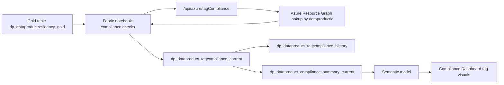

# Solution Module 5: Dashboard Hydration for Tag

## Prerequisite

- Module 1 must be completed.
- `dataproductid` tagging baseline from Module 1 must be in place so resources can be discovered and scored.
- Tag-governance initiatives from `shared/azure-policies/` should be assigned to targeted scopes.

## Architecture Diagram

## Building Blocks

| Component | Artifact | Role |
|---|---|---|
| Notebook | `notebook_fabric_function_sov_compliance_checks_new (5).ipynb` | Executes tag compliance scoring and writes current/history outputs |
| Function API | `/api/azure/tagCompliance` | Evaluates resource-origin and sovereignty-zone tag presence and score |
| Base table | `dp_dataproductresidency_gold` | Product baseline and ID source for batched compliance checks |
| Current output | `dp_dataproduct_tagcompliance_current` | Product-level tag compliance snapshot |
| History output | `dp_dataproduct_tagcompliance_history` | Time-series tag compliance history |
| Summary output | `dp_dataproduct_compliance_summary_current` | Consolidated table used by compliance matrix visuals |
| Policy artifacts | `initiative-origin-tagging.sanitized.json`, `policy-origin-tag-azure-vm.sanitized.json`, `policy-origin-tag-arc-machine.sanitized.json` | Governance policy assets used to enforce and audit required tag behavior |

## Build Instructions

The following steps take you from a clean Module 1 foundation to a running Compliance Dashboard with live tag-governance scores.

### 1. Deploy and configure function app

1. Navigate to `shared/functions/azure-functions/func-purv-contoso/` and deploy the function app.
2. Confirm the `azure_tag_compliance` route is available as `/api/azure/tagCompliance`.
3. Enable Entra ID (EasyAuth) on the function app and confirm the API audience `api://<function-app-client-id>/.default`.
4. Configure required app settings for tag scoring:
	- `RESOURCE_GRAPH_API_VERSION`
	- `AZURE_SUBSCRIPTIONS` (or provide subscriptions in request body)
	- Optional cross-tenant settings for multi-tenant scenarios (`ARM_TENANT_B_*`)
5. Ensure SPN secret `Secret-for-spn-func-compliance-check` is available in `kv-purview-sap` and the notebook identity can retrieve it.

### 2. Assign and validate tag governance policies

1. Deploy policy artifacts from `shared/azure-policies/`:
	- `initiative-origin-tagging.sanitized.json`
	- `policy-origin-tag-azure-vm.sanitized.json`
	- `policy-origin-tag-arc-machine.sanitized.json`
2. Assign policies at the intended management-group or subscription scope.
3. Trigger a policy evaluation cycle and verify compliance states populate for representative resources.

### 3. Import and configure compliance notebook

1. Upload `notebook_fabric_function_sov_compliance_checks_new (5).ipynb` to Fabric and attach it to the target Lakehouse.
2. Validate notebook config values in the setup block (`TENANT_ID`, `CLIENT_ID`, `AUDIENCE`, `FUNC_APP_BASE_URL`, `KV_NAME`, `KV_SECRET_NAME`).
3. Use Synapse Spark runtime.
4. Run setup/helper blocks and execute the tag compliance call block (`/api/azure/tagCompliance`), then run output persistence blocks.

### 4. Validate table outputs

1. Confirm `dp_dataproduct_tagcompliance_current` is populated.
2. Confirm `dp_dataproduct_tagcompliance_history` appends between runs.
3. Confirm `dp_dataproduct_compliance_summary_current` contains updated tag compliance percentage columns for dashboard reporting.

### 5. Configure orchestration and schedule

1. Ensure Fabric pipeline sequencing is Notebook 1 (gold refresh) followed by Notebook 2 (compliance checks).
2. Schedule runs to align with Purview export and policy evaluation cadence.
3. Configure operational alerting on failed pipeline runs.

### 6. Connect semantic model and report

1. Confirm `dp_dataproduct_tagcompliance_current` and summary table columns are mapped in `shared/semantic-model/fabric-model/`.
2. Refresh/publish the semantic model after notebook completion.
3. In `shared/reports/powerbi/`, bind tag visuals and scorecards to the semantic model fields (`TagScorePct` and summary equivalents).
4. Set dashboard tiles to refresh with the semantic model schedule.

### 7. Validate end-to-end behavior

1. Trigger the pipeline.
2. Validate tag compliance scores for known compliant and non-compliant products.
3. Confirm matrix/scorecard visuals update in Power BI after semantic refresh.
4. Validate governance-policy and computed-score outcomes are directionally consistent.

## Testing

1. Validate `/api/azure/tagCompliance` response includes expected tag flags and score values.
2. Validate products with missing required tags receive degraded scores.
3. Validate history table appends and does not overwrite prior snapshots.
4. Validate summary-table tag percentage aligns with current tag table aggregation.
5. Validate dashboard tag visuals update after dataset refresh.

## Comments

- Tag compliance scoring is generated from runtime resource-tag evidence and summarized for the compliance matrix.
- This module is hydration-only and does not require Copilot workflow orchestration.
