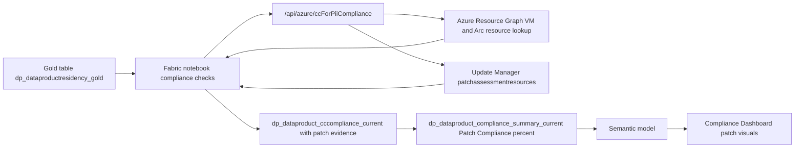

# Solution Module 6: Dashboard Hydration for Patch

## Prerequisite

- Module 1 must be completed.
- Module 3 should be completed because patch signals are collected through the same `/api/azure/ccForPiiCompliance` evidence path.
- Arc onboarding from Module 1 must include VM-class assets targeted for patch posture evaluation.

## Architecture Diagram

## Building Blocks

| Component | Artifact | Role |
|---|---|---|
| Notebook | `notebook_fabric_function_sov_compliance_checks_new (5).ipynb` | Executes compliance scoring path that carries patch evidence |
| Function API | `/api/azure/ccForPiiCompliance` | Returns VM/Arc compute metadata plus patch-assessment signals |
| ARG patch source | `patchassessmentresources` query path via ARG | Supplies patch assessment status and pending update totals |
| Current evidence table | `dp_dataproduct_cccompliance_current` | Stores per-product CC and patch evidence fields used for patch scoring |
| Summary output | `dp_dataproduct_compliance_summary_current` | Publishes patch percentage used in compliance matrix/tiles |
| Policy artifact | `policy-audit-masi-on-arc.sanitized.json` | Supports Arc/patch readiness auditing across scope |

## Build Instructions

The following steps take you from a clean Module 1 foundation to a running Compliance Dashboard with live patch posture percentages.

### 1. Deploy and configure function app

1. Deploy `shared/functions/azure-functions/func-purv-contoso/`.
2. Confirm the `azure_cc_for_pii_compliance` route is available as `/api/azure/ccForPiiCompliance`.
3. Enable Entra ID (EasyAuth) and confirm audience `api://<function-app-client-id>/.default`.
4. Configure app settings required for patch evidence pull:
   - `RESOURCE_GRAPH_API_VERSION` (used for both resources and patchassessmentresources queries)
   - `AZURE_SUBSCRIPTIONS`
   - Optional VM fallback and cross-tenant settings: `VM_API_VERSION`, `ARM_TENANT_B_*`
5. Ensure SPN secret `Secret-for-spn-func-compliance-check` is stored in `kv-purview-sap`.

### 2. Enable patch data sources

1. Ensure Azure Update Manager assessment is enabled on in-scope VM/Arc resources.
2. Confirm patch assessment records are queryable through ARG for in-scope subscriptions.
3. Ensure Arc-connected machines report into Azure for hybrid patch posture visibility.

### 3. Import and configure compliance notebook

1. Upload and attach `notebook_fabric_function_sov_compliance_checks_new (5).ipynb` to the Lakehouse.
2. In notebook setup block, validate `TENANT_ID`, `CLIENT_ID`, `AUDIENCE`, `FUNC_APP_BASE_URL`, `KV_NAME`, `KV_SECRET_NAME`.
3. Set runtime to Synapse Spark.
4. Execute setup/helper blocks and run the CC-for-PII call block (`/api/azure/ccForPiiCompliance`) that also returns patch evidence.
5. Execute persistence and summary blocks to refresh current outputs.

### 4. Validate patch evidence in tables

1. Query `dp_dataproduct_cccompliance_current` and verify patch fields are populated (`PatchAssessmentStatus`, `PendingUpdatesTotal`, and related diagnostics where available).
2. Query `dp_dataproduct_compliance_summary_current` and verify patch compliance percent is present and non-null for applicable products.
3. Run the notebook twice and confirm historical behavior for CC table history if configured in your run path.

### 5. Configure orchestration and schedule

1. Keep notebook order as Notebook 1 then Notebook 2 in Fabric pipeline.
2. Align schedule with patch assessment update cadence and Purview export cadence.
3. Configure pipeline failure notifications.

### 6. Connect semantic model and report

1. Ensure semantic model in `shared/semantic-model/fabric-model/` includes patch-related fields sourced from `dp_dataproduct_cccompliance_current` and summary table patch percentage columns.
2. Refresh semantic model after notebook completion.
3. Configure patch visuals in Power BI report from `shared/reports/powerbi/` to consume patch percentage and supporting details.
4. Ensure dashboard tile refresh follows semantic model refresh timing.

### 7. Validate end-to-end behavior

1. Trigger full pipeline run.
2. Confirm patch assessment evidence is visible for expected VM/Arc products.
3. Confirm patch percentage changes after known patch-state changes (for example, a resource moving from pending updates to no pending updates).
4. Confirm patch visuals in dashboard reflect the new summary values.

## Testing

1. Validate `/api/azure/ccForPiiCompliance` returns patch evidence for VM/Arc-backed products.
2. Validate products without VM/Arc resources are handled without false patch-failure penalties.
3. Validate patch summary percentage calculation is consistent with current table patch fields.
4. Validate semantic model refresh carries updated patch values into report visuals.
5. Validate dashboard patch tile reflects latest pipeline run results.

## Comments

- Patch posture is hydrated through the shared CC/patch evidence route and summarized in the compliance summary table.
- This module focuses on dashboard hydration and does not introduce a Copilot action workflow.
