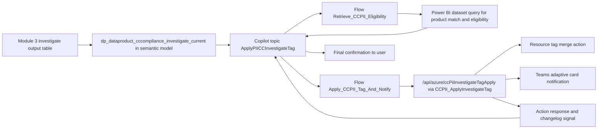

# Solution Module 8: CC-for-PII Compliance via Agent

## Prerequisite

- Module 1 must be completed.
- Module 3 must be completed because this module depends on CC score and investigation outputs.

## Architecture Diagram

## Building Blocks

| Component | Artifact | Role |
|---|---|---|
| Copilot topic | `Default_contosoDataSovereigntyAssistant.topic.ApplyPIICCInvestigateTag` | User conversation and guarded action orchestration |
| Eligibility flow | `Retrieve_CCPII_Eligibility-50BE9EDC-8162-76A3-8EC8-BB961BA97E10.json` | Resolves product and checks single eligible investigation candidate |
| Apply flow | `Apply_CCPII_Tag_And_Notify-A30252E4-DC13-F111-8341-002248081FAF.json` | Executes tag action and posts Teams card |
| Custom connector operation | `CCPII_ApplyInvestigateTag` | Calls function backend for governed tag application |
| Function endpoint | `/api/azure/ccPiiInvestigateTagApply` | Performs tag apply/skip/fail processing and response details |
| Investigation table | `dp_dataproduct_cccompliance_investigate_current` | Source of actionable candidates (`CCScorePct` 50/75 and PII-scoped rows) |

## Build Instructions

The following steps take you from a completed Module 3 baseline to a working Copilot agent that can apply a CC/PII investigation tag to eligible Azure resources and notify via Teams.

### 1. Deploy the CC Investigate function app route

1. Navigate to `shared/functions/azure-functions/cc-investigate/` and confirm the `/api/azure/ccPiiInvestigateTagApply` route is included in your function app deployment.
2. This route requires the function app SPN (`spn-func-compliance-check`) to have **Tag Contributor** (or equivalent role permitting `Microsoft.Resources/tags/write`) on the target subscriptions and resource groups.
3. Additionally, configure the function app to send Teams adaptive card notifications on tag apply. Set the following App Settings:
    - `TEAMS_WEBHOOK_URL`: the incoming webhook URL for the target Teams channel where notifications should be posted.
    - `TAG_KEY_INVESTIGATE`: the tag key to apply (e.g., `CCPIIInvestigate`).
    - `TAG_VALUE_INVESTIGATE`: the tag value to apply (e.g., `true` or a date string).
4. Redeploy after setting environment variables.
5. Test `/api/azure/ccPiiInvestigateTagApply` directly with a sample payload containing a known resource ID, owner email, CC score, and request ID. Confirm the response includes `applied/skipped/failed` counts and a Teams card is posted.

### 2. Import the custom connector (shared with Module 7)

1. If Module 7 was already set up, the custom connector is already imported — verify the `CCPII_ApplyInvestigateTag` operation is visible in the connector's action list.
2. If starting fresh, import the connector from `shared/power-platform/custom-connector/purview-func-app-contoso/` as described in Module 7 Build Instructions step 2.
3. Confirm the `CCPII_ApplyInvestigateTag` operation maps to `POST /api/azure/ccPiiInvestigateTagApply` in the connector definition.

### 3. Create Power Automate connections and import flows

1. In the Power Platform environment, create or reuse the custom connector connection from Module 7.
2. Import the two flows from `shared/power-platform/flows/` in dependency order:
    1. `Retrieve_CCPII_Eligibility` — queries Power BI for eligible investigation candidates from `dp_dataproduct_cccompliance_investigate_current` in the semantic model. Requires a **Power BI** connection pointing to the Module 3 semantic model dataset.
    2. `Apply_CCPII_Tag_And_Notify` — executes tag apply and Teams notification. Requires the custom connector connection.
3. After importing, open each flow and map connection references. Turn both flows **On**.
4. **Important**: Open `Retrieve_CCPII_Eligibility` and inspect the Power BI query action. The current exported version contains a hard-coded `S/4` string in one query path (known issue, documented in Comments). Replace this with the `dataProductName` variable from the flow trigger input or the dynamic input variable from the Copilot topic. This correction must be applied before production use.
5. In `Retrieve_CCPII_Eligibility`, confirm the Power BI dataset reference points to the published semantic model from Module 3. Update the dataset ID in the Power BI action if it shows a stale or placeholder reference.

### 4. Import the Copilot topic

1. Use `copilotagentsolution_1_0_0_1_managed.zip` (in `shared/power-platform/solution-assets/`) or the individual topic XML from `shared/power-platform/copilot-agent/Topic/` as your import source. Prefer the managed solution ZIP for a complete environment.
2. If the managed solution was already imported for Module 7, the `ApplyPIICCInvestigateTag` topic should already be present. Navigate to **Copilot Studio → your agent → Topics** and verify the topic is listed and active.
3. If importing fresh: go to **Solutions → Import solution** in the Power Platform admin center, upload the ZIP, and map the two flow connection references for `Retrieve_CCPII_Eligibility` and `Apply_CCPII_Tag_And_Notify` during import.
4. After import, open the `ApplyPIICCInvestigateTag` topic in Copilot Studio and confirm the flow calls inside the topic reference the correctly imported flows (not stale IDs from a different environment).

### 5. Configure the Copilot agent

1. Confirm the topic trigger phrases are appropriate for your users (e.g., "apply CC PII investigate tag", "tag data product for CC investigation").
2. Ensure the agent is published to the same channel used for Module 7, or to a dedicated channel if this module is deployed independently.
3. If deploying into a shared agent alongside Module 7, verify there is no topic conflict between `ApplyPIICCInvestigateTag` and `PurviewResidencyGlossaryUpdateWorkflow` trigger phrases.
4. Publish the agent.

### 6. Validate the investigation table in the semantic model

1. Open the semantic model from Module 3 in Power BI / Fabric and confirm `dp_dataproduct_cccompliance_investigate_current` is included as a table.
2. Confirm the table has the required columns that the `Retrieve_CCPII_Eligibility` flow's Power BI action queries: `DataProductName`, `CCScorePct`, `ResourceId`, `OwnerEmail`, and any additional columns used in the eligibility logic.
3. If the table is missing, update the semantic model to include it and redeploy/refresh.
4. Ensure the semantic model refresh schedule is running so investigation candidates are current.

### 7. Validate end-to-end flow

1. Start a conversation with the agent in the target channel.
2. Trigger the `ApplyPIICCInvestigateTag` topic using one of its trigger phrases.
3. Provide a data product name that exists in `dp_dataproduct_cccompliance_investigate_current` with `CCScorePct` 50 or 75.
4. Confirm the eligibility flow returns exactly one candidate and the agent presents it for confirmation.
5. Confirm that providing a non-unique or non-matching product name blocks the apply step with a guidance message.
6. After user confirmation, confirm the tag is applied to the Azure resource (check resource tags in the Azure portal).
7. Verify the Teams adaptive card is posted in the configured channel with resource ID, owner email, CC score, tag key/value, and request ID.
8. Confirm the function response payload reflects the correct `applied/skipped/failed` counts.

## Testing

1. Validate exact-match scenario returns one eligible row and enables confirmation path.
2. Validate non-unique or no-match product input blocks apply and returns guidance message.
3. Validate eligible candidate with `CCScorePct` 50 or 75 triggers apply flow with expected payload fields.
4. Validate Teams adaptive card posts with resource id, owner email, score, tag key/value, and request id.
5. Validate result payload correctly reflects `applied/skipped/failed` counts from function response.

## Comments

- Mapped to slide 30 in the PPT mapping you provided.
- Current exported eligibility flow contains a hard-coded `S/4` search string in one query path and should be treated as a known refinement item.